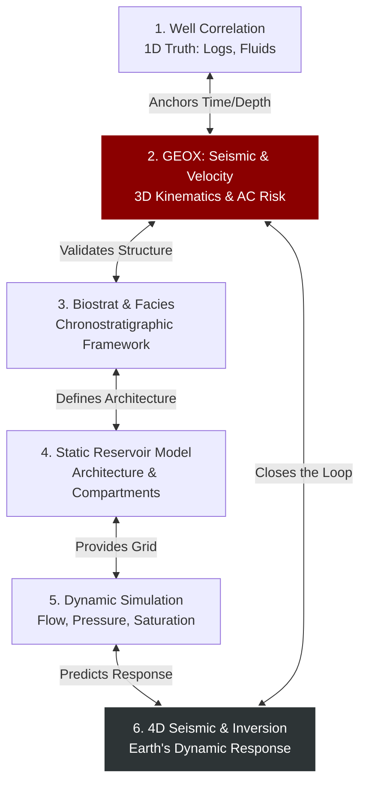

# 008: THE FULL EARTH MODEL LOOP

> **Epistemic Status:** SOVEREIGN ARCHITECTURE
> **Scope:** Defines the closed-loop integration of GEOX within the broader Large Earth Model (LEM) workflow, preventing single-discipline dominance.

## The Architecture of Shared Reality
Different geoscience disciplines speak different languages (logs, waveforms, fossils, grids, production rates). However, they are all describing the **same physical Earth**. GEOX's role is to act as the kinematic referee and physics conscience, ensuring that structural and velocity claims remain mutually honest across the entire lifecycle.

## The Loop

### 1. Well Correlation ↔ Seismic (The Time-Depth Spine)
Wells provide ground truth. GEOX consumes these as constraints. If the 3D velocity model contradicts the 1D well ties (e.g., failed anisotropy gate), GEOX's AC Risk spikes, preventing interpreters from blindly trusting the structural map.

### 2. Seismic ↔ Biostratigraphy (The Time-Rock Framework)
Biostratigraphy defines which surfaces are time-equivalent. GEOX provides the structural scaffolding. If GEOX flags a high AC Risk on a proxy, the stratigrapher must treat the structural map as advisory, preventing the invention of phantom geological accommodation space.

### 3. Biostratigraphy ↔ Reservoir Model (Static Earth)
Static models encode porosity, facies, and faults. GEOX feeds the structural spine and its uncertainty bands into this process. A reservoir modeler must never import a structural grid without its accompanying `VelocityLineageEvent` and AC Risk verdict attached.

### 4. Static ↔ Dynamic ↔ 4D Seismic (Evolving Earth)
Flow simulation turns the static model into a time-evolving pressure field. 4D seismic samples this dynamic response. GEOX provides the time-repeatable, structurally validated baseline, ensuring that 4D differences map to real rock/fluid changes—not mis-timing artifacts.

### 5. Seismic Inversion (Elastic ↔ Petrophysical Earth)
Inversion turns amplitudes into elastic rock properties. GEOX supplies the low-frequency velocity prior. If GEOX flags the prior as weak, the resulting inversion must carry higher uncertainty. The evidence handles link the inversion's QC back to the original Earth-model provenance.

### 6. The Closed Loop
When 4D seismic or production data forces an update to the reservoir model, the new proposed structure is passed back to GEOX. GEOX re-runs the physics gates to verify if the new model is still kinematically possible.

## Why a Loop, Not a Chain?
A linear chain propagates errors silently. A closed loop ensures that:
- No single discipline can silently overrule the others.
- Every claim carries its uncertainty, provenance, and Usage Contract.
- Real-time updates (new wells, new 4D) propagate through a controlled, auditable physics engine instead of ad-hoc manual edits.

## The Anti-Sink, Anti-Gödel Pattern
This loop is explicitly engineered as a **governed reality circuit**, preventing systemic pathologies:

1. **Anti-Gödel Trap:** Gödel's incompleteness warns against systems that pretend internal completeness. The Earth Model Loop is explicitly incomplete by design. By embedding `uncertainty_band`, `AC Risk`, and `federation usage policy` directly into schemas, the system refuses to self-certify its own truth and routes undecidable contradictions to human F13 governance.
2. **Open Strange Loop:** While it resembles a Hofstadter strange loop (Seismic → Stratigraphy → Flow → 4D → Seismic), it never spirals into self-reference because every leg is anchored to *external physical observations* (new checkshots, well logs, production rates).
3. **Anti-Governance Drift (Universe 25):** Calhoun's governance drift occurred in a closed, over-coupled system with no escape valve. The arifOS/GEOX architecture surfaces stress rather than burying it. An AC Risk spike is an alarm that forces a redesign of the hypothesis or acquisition strategy, halting the pipeline before pathology compounds. 

**DITEMPA BUKAN DIBERI.**
