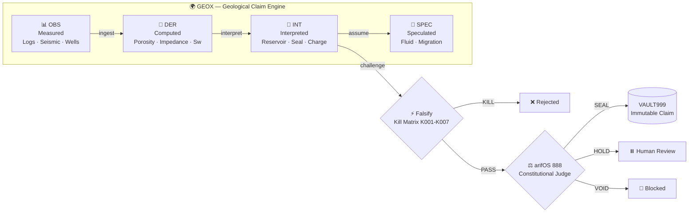

<!-- SOT-MANIFEST
owner: Muhammad Arif bin Fazil (F13 SOVEREIGN)
last_verified: 2026-07-25T06:00Z
valid_until: 2026-08-24
federation_release: v2026.07.25
live_commit: 26b4915b
truth_rule: live :8081/health + tools/list beat any static count in prose
mcp_tools_live: dynamic_from_tools_list
epistemic_standard: OBS / DER / INT / SPEC labels apply to this document itself
-->

**SOT:** 2026-07-25 | **seal_seq:** `26b4915b`

# 🌊 GEOX — Evidence-First Geological Intelligence

> **DITEMPA BUKAN DIBERI** — Forged, not given.
> Earth evidence layer of the arifOS federation. Physics-governed. Evidence-only. Never decides alone.


---

## GEOX in One Minute

GEOX is an evidence-first geological intelligence coprocessor. It ingests wells, seismic, and geological observations; computes subsurface workflows; tracks uncertainty; and preserves the provenance behind every geological claim.

Unlike traditional interpretation software, GEOX separates:

| Layer | Meaning | Example |
|-------|---------|---------|
| **OBS** | Observed — what was measured | Log value, seismic amplitude |
| **DER** | Derived — what was computed | Porosity, impedance |
| **INT** | Interpreted — what was concluded | Reservoir, seal, charge |
| **SPEC** | Speculated — what was assumed | Fluid phase, migration pathway |

Most geological software produces answers. GEOX produces **claims with provenance** — so human experts can separate measurement from inference.

### Why GEOX Exists

Modern subsurface workflows generate interpretations faster than they preserve reasoning. GEOX exists to preserve the chain from evidence to decision — so geological conclusions remain auditable, challengeable, and reproducible.

GEOX is a **geological falsification engine**: the objective is not to confirm interpretations, but to continuously test them against evidence. A claim survives because competing explanations failed, not because it was preferred.

### Claim Lifecycle

```
OBSERVED DATA → DERIVATION → INTERPRETATION → CHALLENGE → FALSIFICATION → SEAL or HOLD
```

Claims can be created, challenged, falsified, recomputed, sealed (immutable record), or held (888_HOLD — awaiting human ratification). Every state transition carries an epistemic label and uncertainty band.

### Federation Organs

| Organ | Role | Port | Repo |
|-------|------|------|------|
| arifOS | Constitutional kernel — judge, seal, VAULT999 | 8088 | [ariffazil/arifos](https://github.com/ariffazil/arifos) |
| AAA | Cockpit + A2A identity layer | 3001 | [ariffazil/AAA](https://github.com/ariffazil/AAA) |
| A-FORGE | Execution shell — build, deploy, forge | 7071 | [ariffazil/A-FORGE](https://github.com/ariffazil/A-FORGE) |
| **GEOX** | Earth intelligence — wells, seismic, petrophysics | 8081 | ← you are here |
| WEALTH | Capital intelligence — NPV, IRR, EMV | 18082 | [ariffazil/WEALTH](https://github.com/ariffazil/WEALTH) |
| WELL | Vitality guard — REFLECT_ONLY | 18083 | [ariffazil/WELL](https://github.com/ariffazil/WELL) |
| HERMES | Multi-modal bridge + Telegram relay | 8644 | [ariffazil/HERMES](https://github.com/ariffazil/HERMES) |



---

## Capabilities

Each capability below carries the same OBS / DER / INT / SPEC standard:

| Task | Status | Label |
|------|--------|-------|
| LAS well log ingestion | ✅ Marmousi + Volve field wells | OBS |
| Petrophysical computation | ✅ Vsh, φ, Sw — Archie + density methods | OBS |
| SEG-Y seismic inspection | ✅ Header, trace count, sample rate, coordinates | OBS |
| Synthetic seismogram generation | ✅ Ricker / Ormsby / Klauder wavelets | OBS |
| Seismic attribute computation | ✅ RMS, sweetness, variance, spectral | OBS |
| Seismic interpretation (horizon / fault) | ✅ Contrast detection + RSI pipeline | DER |
| Basin analysis + deep-time context | ✅ Backstrip, thermal maturity, mass balance | DER |
| Sequence stratigraphy | ✅ Well correlation + biostrat parsing | DER |
| Geomechanics | ✅ Moduli, stress polygon, pore pressure | DER |
| Gravity / magnetic forward modeling | ✅ Prism-based, screening mode | DER |
| Prospect evaluation | ✅ Volumetrics, POS, EVOI | DER |
| Geological claim management | ✅ Create, challenge, falsify, seal | OBS |
| Structural geology battery | ✅ 6/6 Malay Basin battery green — K-DIP arccos (SVD normal vector), full-trace K-THROW (tip→centre→tip), zero-false-negative regime aliasing | OBS |
| MCP Apps (SEP-1865) | ✅ 19 active apps + 3 deprecated + 1 planned — live-attested via `GEOX_MCP_APPS_SURFACE.json` | `resources/list` |
| Cross-organ capital routing | ✅ WEALTH bridge — end-to-end sealed (geology → capital route → VAULT999 receipt) | OBS |

> **Label key:** OBS = directly validated against test data · DER = computed from validated inputs · INT = interpreted / integration claim pending sealed evidence · SPEC = assumed, not yet tested.

---

## Live Surface

| Metric | Value | Source of truth |
|--------|-------|-----------------|
| MCP tools (public canonical) | 32 — live-witnessed 2026-07-25 (`tools_loaded: 32`) | `curl :8081/health` + `tools/list` |
| MCP Apps | 19 active + 3 deprecated + 1 planned (SEP-1865) — canonical source: `GEOX_MCP_APPS_SURFACE.json` | `resources/list` |
| ui:// resources | 8 | server manifest |
| Health | **not asserted statically** — verify live | `curl :8081/health` |
| Port | 8081 | deployment config |
| Version | `v2026.07.24` | SOT-MANIFEST |
| License | BSL-1.1 → Apache 2.0 on 2029-06-29 (see note below) | [LICENSE](./LICENSE) + `pyproject.toml` |

> **F4 Clarity rule:** Runtime health and tool counts are witnessed live, not asserted as static prose — per the SOT truth rule, `/health` and `tools/list` are the only valid witnesses. The value 32 above is an OBS-recorded snapshot of the 2026-07-25 witness, not a standing claim. (Earlier prose citing 52 tools reflected an unconsolidated legacy list and has been retired.)

---

## Validated Datasets

| Dataset | Type | Status |
|---------|------|--------|
| **Marmousi2** | Synthetic 2D seismic + 3 wells | ✅ Full pipeline |
| **Volve field** | Real North Sea wells + production | ✅ Well logs ingested (12+ curves) |
| | | ⚠️ SEG-Y pending (Equinor license required) |

---

## MCP Apps (SEP-1865)

Authoritative surface: `GEOX_MCP_APPS_SURFACE.json` — generated by `scripts/generate_mcp_apps_surface.py`. Contains 19 active, 3 deprecated, and 1 planned UI resources with bound tool contracts, CSP domains, and content hashes. Do not hand-maintain app lists in prose.

Connect via: `https://geox.arif-fazil.com/mcp`

---

## Quick Start

**Prerequisites:** Python 3.11+, pip, and (for seismic workflows) write access to a data directory for LAS / SEG-Y ingestion.

```bash
# Install
cd /root/GEOX && pip install -e ".[dev]"

# Run tests
PYTHONPATH=src pytest tests/ -q --tb=short

# Start server
python -m geox_mcp.server

# Health check — the only valid health witness
curl http://localhost:8081/health
```

### Ingest a well log
```
geox_well_ingest(mode="auto", source_uri="/data/wells/my-well.las", well_id="MY-WELL-1")
```

### Compute petrophysics
```
geox_petrophysics(mode="generate", well_id="MY-WELL-1",
  curves={...}, matrix_density=2.65, rw=0.05)
```

---

## Architecture

GEOX separates four things that most subsurface software conflates:

1. **Observation** — what was measured (log value, seismic amplitude)
2. **Derivation** — what was computed (porosity, impedance)
3. **Interpretation** — what was concluded (reservoir, seal, charge)
4. **Speculation** — what was assumed (fluid phase, migration pathway)

Every output carries an epistemic label (OBS / DER / INT / SPEC) and an uncertainty band.

**Failure contract:** when governance checks fail, GEOX fails closed — `888_HOLD` (result generated but awaiting human ratification) for outputs needing review, `VOID` for ungrounded claims. No silent degradation, no ungoverned output.

### Governance Vocabulary

GEOX operates within the arifOS federation's constitutional framework. Key terms:

| Term | Meaning |
|------|---------|
| **Physics-governed** | Where geological interpretations conflict with physical observations, observations win until falsified |
| **F13 SOVEREIGN** | Human veto — Arif's decision is final. No agent self-authorizes |
| **888_HOLD** | Governance state: result generated but awaiting human ratification before action |
| **VAULT999** | Append-only, hash-chained immutable record — decisions are sealed, not overwritten |
| **SEP-1865** | MCP Apps specification — the protocol that defines how GEOX UI apps connect to the MCP surface |
| **SOT** | Source of Truth — the live runtime state (`/health`, `tools/list`) that beats any static claim |

---

## Repository

```
src/geox_core/         ← Physics truth engine (NOT agent-facing)
    engines/petrophysics/   ← PINN, Archie, Sw, net-pay
    engines/seismic/        ← AC risk, synthetic, well-tie

src/geox_mcp/          ← MCP agent surface
    tools/                  ← Canonical public tool surface (32, live-witnessed)
    resources/              ← 8 ui:// resources
    prompts/                ← MCP prompt templates

apps/                   ← MCP Apps registry — canonical source: GEOX_MCP_APPS_SURFACE.json
docs/                   ← Documentation
tests/                  ← Test suite (60+ files; 75/75 unit + 6/6 structure battery)
GENESIS/                ← Constitutional charter
```

---

## What GEOX Is Not

GEOX is **not** a replacement for Petrel, DecisionSpace, PaleoScan, or OpendTect. It cannot edit horizons interactively, build geocellular grids, or run reservoir simulation.

It IS a vendor-neutral layer that can:
- Challenge interpretations from incumbent software
- Preserve the evidence behind every geological claim
- Compute selected subsurface workflows with full provenance
- Route capital consequences from geology to decision frameworks

---

## Next Horizons

> Items below are **SPEC** until sealed by test evidence. This section documents what is being forged — not what is claimed.

| Horizon | Blocker / dependency | Status |
|---------|---------------------|--------|
| Volve SEG-Y full seismic pipeline | Equinor license clearance | ⚠️ Gated |
| WEALTH bridge integration sealing | End-to-end sealed test (geology → capital route) | ✅ OBS |
| Expanded `ui://` resource surface | SEP-1865 spec evolution | SPEC |
| Public tool inventory publication | `tools/list` snapshot in `docs/` per release | Planned |

---

## Audit History

> Governance record — not required for understanding GEOX. Preserved here for constitutional traceability.

| Date | Milestone | Detail |
|------|-----------|--------|
| 2026-07-25 | **Deep MCP Readiness Audit** | FIGHT-TEST: 3-agent audit (OpenCode + Claude + ChatGPT); 8 surgical fixes deployed — session binding, false-confidence wrapper, AVO auto-compute, structure falsification auto-ID, correlation HALT-on-empty, ToAC overclaim correction, petrophysics auto-QC gate, ok:true→false on INVALID |

| 2026-07-23 | **Phase C hardening** | K-DIP/K-DL/K-THROW regime aliases wired (commit `8ce723b0`); 6/6 Malay Basin test battery PASS |
| 2026-07-23 | **Phase C Sealed State** | K-DIP arccos (SVD normal vector math), full-trace K-THROW (tip→centre→tip), zero-false-negative regime aliasing — **75/75 unit tests + 6/6 Malay Basin battery green** |
| 2026-07-23 | **License Falsification Audit** | AGPL marking identified as drift; BSL-1.1 confirmed against LICENSE + `pyproject.toml` |
| 2026-07-19 | **P0/P1 — MCP Restore** | FastMCP 3.4.2 kwargs fix, tools registered; `prefab-ui` installed, 6 apps LIVE, GUI-ready |
| 2026-07-19 | **SOT Audit** | License corrected (AGPL→BSL-1.1), version aligned, tool count synced |
| 2026-07-19 | **Gitwrap** | 4 feature branches removed, 2600+ lint errors fixed, CI advisory |

---


## 🔗 Federation

| Organ | Role | Repo | MCP | Health | LLMs |
|-------|------|------|-----|--------|------|
| **arifOS** | Kernel — judges, seals | [repo](https://github.com/ariffazil/arifos) | [mcp](https://mcp.arif-fazil.com/mcp) | [health](https://arifos.arif-fazil.com/health) | [llms.txt](https://arifos.arif-fazil.com/llms.txt) |
| **A-FORGE** | Executor — builds, deploys | [repo](https://github.com/ariffazil/A-FORGE) | [mcp](https://forge.arif-fazil.com/mcp) | [health](https://forge.arif-fazil.com/health) | [llms.txt](https://forge.arif-fazil.com/llms.txt) |
| **AAA** | Cockpit — displays, routes | [repo](https://github.com/ariffazil/AAA) | — | [health](https://aaa.arif-fazil.com/health) | [llms.txt](https://aaa.arif-fazil.com/llms.txt) |
| **GEOX** | Earth intelligence | [repo](https://github.com/ariffazil/GEOX) | [mcp](https://geox.arif-fazil.com/mcp) | [health](https://geox.arif-fazil.com/health) | [llms.txt](https://geox.arif-fazil.com/llms.txt) |
| **WEALTH** | Capital intelligence | [repo](https://github.com/ariffazil/WEALTH) | [mcp](https://wealth.arif-fazil.com/mcp) | [health](https://wealth.arif-fazil.com/health) | [llms.txt](https://wealth.arif-fazil.com/llms.txt) |
| **WELL** | Vitality guard | [repo](https://github.com/ariffazil/WELL) | [mcp](https://well.arif-fazil.com/mcp) | [health](https://well.arif-fazil.com/health) | [llms.txt](https://well.arif-fazil.com/llms.txt) |
| **HERMES** | Multi-modal bridge | [repo](https://github.com/ariffazil/HERMES) | — | — | — |

**Public:** [arif-fazil.com](https://arif-fazil.com) · **Federation root:** [arifos.arif-fazil.com](https://arifos.arif-fazil.com)
**SOT:** 2026-07-24

## License

**BSL-1.1 (Business Source License 1.1)** — converts to **Apache 2.0 on 2029-06-29** per the Change Date in [LICENSE](./LICENSE) (confirmed against `pyproject.toml`).

> **License history:** GEOX was briefly marked AGPL prior to the 2026-07-19 SOT Audit, which corrected it to BSL-1.1; a falsification audit on 2026-07-23 re-confirmed BSL-1.1 as canonical. All copies from 2026-07-19 onward are BSL-1.1.

---

*Maintained under F13 SOVEREIGN. Built on Marmousi, validated on Volve.*
*DITEMPA BUKAN DIBERI — truth must cool before it rules.*
