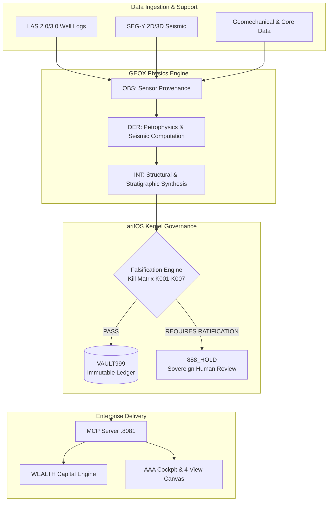

<!-- SOT-MANIFEST
owner: Muhammad Arif bin Fazil (F13 SOVEREIGN)
last_verified: 2026-08-01T00:45:00Z
valid_until: 2026-09-01
federation_release: v2026.08.01
live_commit: 6d8c2009
truth_rule: live :8081/health + tools/list beat any static count in prose
mcp_tools_live: 33
epistemic_standard: OBS / DER / INT / SPEC labels apply to this document itself
-->

# 🌍 GEOX — Evidence-First Subsurface Coprocessor & Geological Intelligence Engine

[](https://github.com/ariffazil/GEOX/actions)
[](https://geox.arif-fazil.com/mcp)
[](https://arifos.arif-fazil.com)
[](./LICENSE)

**GEOX** is an enterprise-grade geological intelligence and subsurface coprocessor designed for modern E&P digital transformation, energy transition workflows, and automated subsurface auditing. Powered by physics-governed computation engines and strict provenance tracking, GEOX bridges raw geoscientific observation with executive capital decision-making.

---

## Executive Overview

Modern subsurface evaluation requires processing heterogeneous data (well logs, SEG-Y seismic, biostratigraphy, geomechanics) while maintaining an auditable lineage from observation to commercial decision. GEOX introduces **Epistemic Layering**, enforcing explicit segregation between empirical measurement and interpretive inference:

| Layer | Classification | Enterprise Meaning | Domain Examples |
|:---:|:---:|:---|:---|
| **OBS** | **Observed** | Directly measured sensor & physical data | Wireline logs (LAS), SEG-Y trace amplitudes, core measurements |
| **DER** | **Derived** | Deterministic physical & mathematical computations | Effective porosity ($\phi$), Acoustic Impedance ($Z$), Water Saturation ($S_w$) |
| **INT** | **Interpreted** | Synthesized geological evaluations & frameworks | Horizons, fault polygons, reservoir-seal-charge frameworks |
| **SPEC** | **Speculated** | Unvalidated operational & fluid assumptions | Migration pathways, fluid phase boundaries, compartmentalization |

### Key Enterprise Value Drivers

1. **Falsification-First Subsurface Analytics:** Rather than confirming biased interpretation models, GEOX subjects all claims to rigorous physical stress-testing (falsification), reducing exploration risk and dry-hole capital wastage.
2. **Auditability & Provenance:** Every computed attribute, horizon, or volumetric estimate generates a cryptographically sealed receipt in **VAULT999**, providing immutable audit trails for regulatory compliance and partner reviews.
3. **Vendor-Neutral Integration:** Operates seamlessly alongside incumbent subsurface platforms (Petrel, DecisionSpace, PaleoScan) to validate interpretations and pipe results directly into financial decision engines.

---

## System Architecture



---

## Core Capabilities

GEOX delivers 33 canonical, high-performance tools accessible via standard Model Context Protocol (MCP) and REST endpoints:

- **Well Log & Petrophysical Analytics (`OBS` / `DER`):** Automated LAS 2.0/3.0 ingestion, Archie & Simandoux water saturation, density-neutron crossplot porosity, and net-pay determination.
- **Seismic Processing & Attribute Extraction (`OBS` / `DER`):** SEG-Y header inspection, synthetic seismogram generation (Ricker/Ormsby wavelets), AVO gradient analysis, RMS sweetness, and spectral decomposition.
- **Structural & Basin Modeling (`DER`):** 6-point Malay Basin structural stress battery, K-DIP normal vector estimation, full-trace K-THROW fault displacement analysis, backstripping, and thermal maturity history.
- **Geomechanics & Pore Pressure (`DER`):** Elastic moduli calculation, stress polygon estimation, and pore pressure prediction.
- **Capital & Risk Routing (`INT`):** Automated Volumetrics (STOIIP/GIIP), Probability of Success (POS), and seamless bridging to the **WEALTH** organ for expected monetary value (EMV) analysis.

---

## Enterprise Deployment & Quick Start

### Deployment Topology

GEOX is deployed as a bare-metal containerized microservice or systemd daemon operating on port **8081**, exposing an MCP-compliant endpoint:

```
Public Endpoint: https://geox.arif-fazil.com/mcp
Local Daemon:    http://127.0.0.1:8081
```

### Production Setup

```bash
# 1. Clone repository
git clone https://github.com/ariffazil/GEOX.git /opt/geox/app
cd /opt/geox/app

# 2. Setup environment & dependencies (Python 3.11+)
uv sync --frozen

# 3. Execute test suite (Unit & Structural Battery)
PYTHONPATH=src pytest tests/ -q --tb=short

# 4. Deploy service via systemd
systemctl restart geox-mcp
```

### Health Verification

To verify production operational status and active tool availability:

```bash
curl -s http://127.0.0.1:8081/health | jq .
```

*Expected output:* `{"status": "healthy", "tools_loaded": 33, ...}`

---

## 🔗 Federation Architecture & Navigation

GEOX operates as an Earth Intelligence organ within the **arifOS Federation**. Every organ maintains distinct boundaries and capabilities:

| Organ | Domain Role | Port | Repo | Live MCP | Health Witness | Machine Spec |
|:---|:---|:---:|:---|:---|:---|:---|
| **arifOS** | Constitutional Kernel & Judge | 8088 | [repo](https://github.com/ariffazil/arifos) | [mcp](https://mcp.arif-fazil.com/mcp) | [health](https://arifos.arif-fazil.com/health) | [llms.txt](https://arifos.arif-fazil.com/llms.txt) |
| **A-FORGE** | Governed Execution Engine | 7071 / 7072 | [repo](https://github.com/ariffazil/A-FORGE) | [mcp](https://forge.arif-fazil.com/mcp) | [health](https://forge.arif-fazil.com/health) | [llms.txt](https://forge.arif-fazil.com/llms.txt) |
| **AAA** | Institution, Control Plane & A2A | 3001 | [repo](https://github.com/ariffazil/AAA) | — | [health](https://aaa.arif-fazil.com/health) | [llms.txt](https://aaa.arif-fazil.com/llms.txt) |
| **GEOX** | Earth Intelligence (Subsurface) | 8081 | [repo](https://github.com/ariffazil/GEOX) | [mcp](https://geox.arif-fazil.com/mcp) | [health](https://geox.arif-fazil.com/health) | [llms.txt](https://geox.arif-fazil.com/llms.txt) |
| **WEALTH** | Capital Intelligence (Compute) | 18082 | [repo](https://github.com/ariffazil/WEALTH) | [mcp](https://wealth.arif-fazil.com/mcp) | [health](https://wealth.arif-fazil.com/health) | [llms.txt](https://wealth.arif-fazil.com/llms.txt) |
| **WELL** | Vitality & Readiness Guard | 18083 | [repo](https://github.com/ariffazil/WELL) | [mcp](https://well.arif-fazil.com/mcp) | [health](https://well.arif-fazil.com/health) | [llms.txt](https://well.arif-fazil.com/llms.txt) |
| **HERMES** | Multi-Modal Bridge & Telegram Relay | 8644 | [repo](https://github.com/ariffazil/HERMES) | — | — | — |

**Public Domain:** [arif-fazil.com](https://arif-fazil.com) · **Federation Root:** [arifos.arif-fazil.com](https://arifos.arif-fazil.com)

---

## Enterprise Licensing & Governance

- **Licensing:** Business Source License 1.1 (**BSL-1.1**), converting to open-source **Apache 2.0** on **2029-06-29** (see [LICENSE](./LICENSE)).
- **Governance:** Operating under F13 Sovereign Human Veto. Decisions requiring human oversight trigger `888_HOLD` status until ratified by authorized asset team members.

---

*Maintained under F13 SOVEREIGN. Built on Marmousi, validated on Volve.*  
*DITEMPA BUKAN DIBERI — truth must cool before it rules.*


