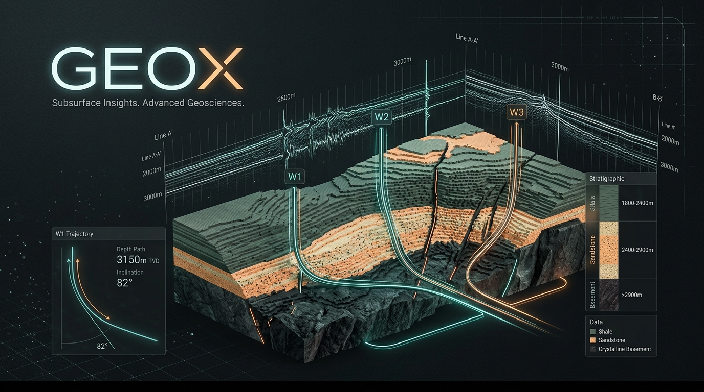

<!-- SOT-MANIFEST
owner: Arif
last_verified: 2026-07-06
federation_release: v2026.07.04-MCP-A2A
changelog: /root/CHANGELOG-2026-07-04.md
a2a_agent_json: /root/GEOX/.well-known/agent.json
valid_from: 2026-06-14
valid_until: 2026-08-04
confidence: high
scope: /root/geox
-->

```
╔══════════════════════════════════════════════════════════════════╗
║                                                                  ║
║      ██████╗ ███████╗ ██████╗ ██╗  ██╗                          ║
║     ██╔════╝ ██╔════╝██╔═══██╗╚██╗██╔╝                          ║
║     ██║  ███╗█████╗  ██║   ██║ ╚███╔╝                           ║
║     ██║   ██║██╔══╝  ██║   ██║ ██╔██╗                           ║
║     ╚██████╔╝███████╗╚██████╔╝██╔╝ ██╗                          ║
║      ╚═════╝ ╚══════╝ ╚═════╝ ╚═╝  ╚═╝                          ║
║                                                                  ║
║          EARTH INTELLIGENCE — GOVERNED WORLD MODEL               ║
║                                                                  ║
║     Physics-constrained subsurface reasoning for the machine     ║
║     Evidence-only. Earth truthful. arifOS governed.              ║
║                                                                  ║
║              DITEMPA BUKAN DIBERI — Forged, Not Given            ║
║                                                                  ║
╚══════════════════════════════════════════════════════════════════╝
```

# GEOX — Governed Earth Intelligence



> **Public surface: canonical MCP tools only** (verify with `tools/list` at runtime)
> **Governance: arifOS F1–F13 · 888 JUDGE · VAULT999**
> **Authority: evidence-only · no drilling decision · no capital allocation**
> **No backward compatibility surface. Canonical only.**

**What is it?** Physics-constrained, evidence-grounded subsurface reasoning — well logs, seismic, petrophysics, basin, prospect, stratigraphy, multi-physics joint inversion (Physics13), CSEM/MT, geomechanics, doctrine layer, federation integration (WELL/WEALTH).

**What can I do with it?** Ingest well logs, run seismic physics, compute petrophysics, screen basins, evaluate prospects, create structured evidence claims, challenge interpretations, prepare cases for constitutional adjudication.

**What must I never trust it to do?** Authorize drilling, allocate capital, self-seal claims, override arifOS, replace human geological judgment.

**How do I run it?** `uv sync --frozen` then `python3 -m geox_mcp.server --transport stdio` (local) or `systemctl restart geox-mcp` (production on port 8081).

**How do I verify it is alive?** `curl http://127.0.0.1:8081/health` → `{"status":"healthy","canonical_tools":"<N>",...}` or call `geox_surface_status(mode="health")` for full registry probe. Tool count varies by build — run `tools/list` for the exact number.

GEOX is the **Earth Intelligence organ** of the [arifOS Constitutional Federation](https://github.com/ariffazil/arifos). It **witnesses** the Earth and hands evidence to arifOS for adjudication. It never authorizes. It never allocates capital.

**Federation Position (canonical organ map):**

```
Arif (F13 SOVEREIGN)
    ↓
AAA / Hermes / OpenClaw (A2A)
    ↓
arifOS KERNEL (F1-F13, :8088)
    ↓
GEOX (EARTH, :8081)  ← witness only, evidence-only
    ↓
A-FORGE (:7071)  ← executes after SEAL
    ↓
VAULT999  ← immutable record
```

| Field | Current |
|---|---|
| Runtime | Python FastMCP 3.4.2 |
| Public MCP surface | 35 canonical tools (verify with `tools/list` at runtime) |
| Internal capability contracts | Canonical surface only (no public legacy surface) |
| License | Business Source License 1.1 (BSL-1.1) |
| Governance | arifOS F1–F13 |
| Authority | Evidence-only |
| Status | Active (v2026.06.29-BSL-GOVERNANCE); verify with `curl :8081/health` |

[](https://github.com/ariffazil/GEOX/actions/workflows/forge.yml)
[](https://github.com/ariffazil/GEOX/actions/workflows/agentic-ci.yml)
[](https://github.com/ariffazil/GEOX/actions/workflows/governance-gate.yml)
[](LICENSE)

---

## 1. EPISTEMIC RIGOR — Why GEOX Is Real Earth Science

GEOX is not a chatbot with geology vocabulary. It is a **physics-constrained evidence coprocessor**:

- **Evidence grades on every output** — CLAIM / PLAUSIBLE / HYPOTHESIS / ESTIMATE / UNKNOWN.
- **Uncertainty bands on every estimate** — P10 / P50 / P90, not single numbers.
- **Contradiction scan on every claim** — `evidence_for`, `evidence_against`, `missing_tests` are mandatory for hypotheses.
- **Units and physical bounds** — every tool output carries units; every state vector is clipped to Earth-admissible ranges (Physics13).
- **Provenance chains** — every result carries an artifact reference, source tool, and derivation hash.
- **No black-box claims** — `geox_evidence` and `geox_claim_challenge` enforce multi-discipline self-argument.
- **Constitutional floor enforcement** — F1 AMANAH (reversibility), F2 TRUTH (evidence labels), F4 CLARITY (ΔS ≤ 0), F7 HUMILITY (confidence ≤ 0.90), F9 ANTI-HANTU (no sentience claims), F11 AUDIT (immutable trace), F13 SOVEREIGN (human veto).

The crustal domain grammar is grounded in **Huang et al. (2021)**, *Tectonics*, OBS2013-1 profile — 10,346 picked arrivals, ±0.3 km/s Vp uncertainty, 7-zone Vp taxonomy.

### 1.1 RASA Context-Fit

**RASA** = **R**elevance-**A**ware **S**ubstrate **A**lignment — a 0–1 score that measures how well a geological claim fits its evidence context.

```
RASA = evidence_credit × (1 − u_ambiguity)
```

- `evidence_credit` — fraction of required evidence artifacts present and valid.
- `u_ambiguity` — physical ambiguity remaining after all constraints are applied.
- F7 HUMILITY caps the score at **0.90**; GEOX never claims perfect context fit.

RASA is computed inside `compute_ac_risk_governed(..., rasa_present=True)` and emitted on every governed evidence receipt. It is not a replacement for human judgment; it is a fast signal for whether a claim is anchored to its substrate or floating in abstraction.

---

## APEX STACK Bridge

> APEX THEORY defines the constitutional dynamics of governed intelligence through ΔΩΨ. arifOS compiles those dynamics into an AGI substrate kernel. AAA renders the substrate as visible ASI civilization state. A-FORGE gives the system governed hands. GEOX, WEALTH, and WELL anchor those hands to earth, capital, and human reality. VAULT999 preserves consequence. Arif/F13 remains the sovereign witness and final veto.

**GEOX must never:** authorize drilling, issue resource estimates without arifOS SEAL, or make policy decisions.

Full doctrine: [GENESIS/040_APEX_STACK.md](https://github.com/ariffazil/arifos/blob/main/GENESIS/040_APEX_STACK.md)

---

## 2. FEDERATION POSITION

GEOX operates under the arifOS constitutional kernel. It is not autonomous. It is evidence-only.

```
                         ┌──────────────────┐
                         │   ARIF FAZIL      │
                         │  F13 SOVEREIGN    │
                         │  Final Veto       │
                         └────────┬─────────┘
                                  │
                         ┌────────▼─────────┐
                         │     arifOS        │
                         │  Constitutional   │
                         │  Kernel (8088)    │
                         │  F1-F13 · 888     │
                         │  JUDGE · VAULT999 │
                         └──┬────┬────┬─────┘
                            │    │    │
            ┌───────────────┘    │    └───────────────┐
            │                    │                    │
   ┌────────▼────────┐  ┌───────▼────────┐  ┌───────▼────────┐
   │      GEOX       │  │     WEALTH     │  │      WELL      │
   │  Earth Evidence │  │ Capital Intel  │  │ Human Readiness│
   │    Port 8081    │  │  Port 18082    │  │  Port 18083    │
   │  EVIDENCE-ONLY  │  │  ADVISORY ONLY │  │ REFLECT-ONLY   │
   └────────┬────────┘  └───────┬────────┘  └───────┬────────┘
            │                    │                    │
            └────────────────────┼────────────────────┘
                                 │
                         ┌───────▼────────┐
                         │   888 JUDGE    │
                         │  (arifOS)      │
                         │  SEAL / SABAR  │
                         │  HOLD / VOID   │
                         └───────┬────────┘
                                 │
                         ┌───────▼────────┐
                         │   VAULT999     │
                         │ Immutable Led- │
                         │ ger (8100/5001)│
                         └────────────────┘
```

### What GEOX IS

- **An earth evidence coprocessor** — it ingests well logs, seismic volumes, DST data, and geological reports; it runs petrophysics, stratigraphy, and prospect evaluation; it outputs structured, physics-constrained evidence receipts.
- **Constitutionally governed** — every output carries epistemic tags (CLAIM / PLAUSIBLE / HYPOTHESIS / ESTIMATE / UNKNOWN), uncertainty bands (P10/P50/P90), and provenance chains.
- **Agent-accessible** — all 35 canonical tools are callable via MCP over HTTP (port 8081) or stdio (local agents). Integrated public frontdoor: `https://mcp.arif-fazil.com/mcp` (proxies internally through arifOS).
- **Dual-transport** — systemd service (`geox-mcp.service`) for HTTP/SSE; `--transport stdio` for Claude Code, OpenCode, Continue CLI, and other local agents.

### What GEOX IS NOT

- **NOT a drilling authority** — GEOX does not issue drill recommendations. It computes evidence. arifOS 888 JUDGE adjudicates the verdict. Arif (F13 SOVEREIGN) makes the final decision.
- **NOT a capital allocator** — NPV, IRR, portfolio scoring, and economic viability belong to WEALTH (port 18082).
- **NOT a black-box oracle** — every output must cite physical evidence (well logs, seismic, DST, core). Hallucination has no place here. F2 TRUTH: τ ≥ 0.99.
- **NOT an autonomous agent** — GEOX cannot self-authorize. Every irreversible action (SEAL, SEG-Y export, prospect seal) routes through arifOS 888 JUDGE with F1 AMANAH gating.

---

## 3. QUICK START

### 3.1 Install

```bash
cd /root/geox
uv sync --frozen                    # production
uv sync --frozen                    # with dev deps (pytest, ruff, mypy)
```

Requires Python 3.11+. FastMCP ≥ 3.4.2 with Tasks extension. Pydantic v2. Dependencies: `lasio`, `welly`, `striplog`, `numpy`, `scipy`, `matplotlib`, `segyio`, `scikit-learn`, `statsmodels`.

### 3.2 Run (HTTP — systemd)

The production service is managed by systemd:

```bash
systemctl status geox-mcp
systemctl restart geox-mcp
journalctl -u geox-mcp -n 50 --no-pager
```

Manual start (local debugging only):

```bash
cd /root/geox
python3 -m geox_mcp.server --host 127.0.0.1 --port 8081
```

### 3.3 Run (stdio — local agents)

```bash
cd /root/geox
python3 -m geox_mcp.server --transport stdio
```

For Claude Code, add to `~/.claude/settings.json`:

```json
{
  "mcpServers": {
    "geox": {
      "command": "python3",
      "args": ["-m", "geox_mcp.server", "--transport", "stdio"],
      "cwd": "/root/geox"
    }
  }
}
```

### 3.4 Health Check

```bash
# Local
curl http://127.0.0.1:8081/health

# Public (Cloudflare Tunnel)
curl https://geox.arif-fazil.com/health

# Expected response (current as of RASA release):
# {"status":"healthy","service":"geox-unified","canonical_tools":"<N>","git_version":"geox-<HEAD>","contract_epoch":"2026-06-28-GEOX-CANONICAL-RASA",...}
# Tool count varies by build — run `tools/list` at runtime for exact number.
```

### 3.5 Build & Test

```bash
make install      # uv sync --frozen
make test         # PYTHONPATH=src pytest tests/ -q --tb=short
make smoke        # PYTHONPATH=src python scripts/smoke_test.py
make lint         # ruff check + mypy
make format       # ruff format
make forge        # security-audit (Trivy + Semgrep + Gitleaks + Ruff)
```

---

## 🔌 MCP Connection

Connect to GEOX via the Model Context Protocol:

| Property | Value |
|----------|-------|
| **Endpoint** | `https://geox.arif-fazil.com/mcp` |
| **Transport** | Streamable HTTP (JSON-RPC 2.0) |
| **Tools** | 46 canonical tools |
| **Health** | `https://geox.arif-fazil.com/health` |

### Claude Code / Cursor

Add to your MCP client config:
```json
{
  "mcpServers": {
    "geox": {
      "url": "https://geox.arif-fazil.com/mcp"
    }
  }
}
```

### Direct Usage

```bash
curl -X POST https://geox.arif-fazil.com/mcp \
  -H "Content-Type: application/json" \
  -H "Accept: application/json" \
  -d '{"jsonrpc":"2.0","method":"tools/list","id":1}'
```

---

## 4. CAPABILITY MAP — 30 CANONICAL TOOLS

All 35 canonical tools are callable via the single gateway at `https://mcp.arif-fazil.com/mcp` (HTTP) or `stdio`. Each tool carries `outputSchema`, MCP spec annotations, epistemic tags, uncertainty bands, provenance, and a `godel_wall` verdict. Every call is hardened by `src/geox_mcp/floor_enforcement.py` (F1 AMANAH, F4 CLARITY, F7 HUMILITY ≤0.90, F9 ANTI-HANTU, F11 AUDIT, F13 SOVEREIGN).

**35 canonical tools** — Phase 2.1 (locked 2026-06-28, RASA release 2026-06-29):

| Domain | Tools |
|--------|-------|
| **Wells & Stratigraphy** | `geox_well_ingest`, `geox_well_qc`, `geox_well_desurvey`, `geox_petrophysics`, `geox_sequence` |
| **Seismic** | `geox_seismic_ingest`, `geox_seismic_compute`, `geox_seismic_interpret`, `geox_vision` |
| **Subsurface & Geomechanics** | `geox_subsurface_model`, `geox_geomechanics` |
| **Basin & Deep Time** | `geox_basin`, `geox_deep_time_state`, `geox_isitwater`, `geox_context_at_location`, `geox_surface_status` |
| **Earth Governance Surface (EGS)** | `geox_egs_query_entity`, `geox_egs_query_claim`, `geox_egs_query_uncertainty`, `geox_egs_query_provenance`, `geox_egs_claim_create`, `geox_egs_claim_challenge`, `geox_egs_evidence_attach`, `geox_egs_evidence_reason`, `geox_egs_seismic_compute`, `geox_egs_rock_physics`, `geox_egs_data_qc_bundle`, `geox_egs_scenario_audit` |
| **Internal Federation** | `geox_claim`, `geox_evidence`, `geox_prospect`, `geox_doctrine` |

Only canonical tool names on the public surface. Legacy internal mappings (if any) are not part of the governed contract.

---

## 5. BOUNDARY DECLARATION

### GEOX OWNS

| Domain | Description |
|--------|-------------|
| **Well Log Analysis** | LAS/DLIS ingestion, curve standardization, depth normalization, petrophysical computation |
| **Seismic Intelligence** | Volume I/O, attribute computation, forward modeling, well ties, time-depth conversion, AVO/AC detection |
| **Stratigraphy** | L1–L3 sequence stratigraphy, GR binning, depositional package building, systems tract inference |
| **Basin Screening** | Basin resolution, petroleum system analysis, play fairway mapping, contradiction scanning |
| **Prospect Evaluation** | Volumetrics, POS calculation, EVOI, structural position analysis |
| **Spatial Evidence** | CRS validation, coordinate transforms, bbox rendering, scene generation |
| **Claims & Evidence** | Structured claim creation, validation, challenge (multi-discipline self-argument), sealing pipeline |
| **Data QC** | Depth monotonicity, null detection, physical range checks, FJIS (Feature Joint Information Statistic) |
| **Vision AI** | Seismic image interpretation, VLM calibration, AC_Risk scoring, perceptual inventory validation |
| **Fault Interpretation** | Fault stick ingestion, FaultSet3d canonical schema |
| **DST Analysis** | Drill-stem test ingestion, derived metrics, PVT flags |
| **Earth-Truth Artifacts** | Structured JSON outputs, PNG renderings, XLSX reports, geological memos |

### GEOX NEVER

| Prohibition | Why |
|-------------|-----|
| ❌ Issue drilling decisions | F13 SOVEREIGN territory — only Arif authorizes drilling |
| ❌ Allocate capital | WEALTH owns NPV/IRR/portfolio scoring |
| ❌ Adjudicate constitutional verdicts | arifOS 888 JUDGE owns SEAL/SABAR/HOLD/VOID |
| ❌ Self-authorize irreversible actions | Every SEAL routes through arifOS F1 AMANAH gate |
| ❌ Fabricate evidence | F2 TRUTH: τ ≥ 0.99 — all outputs must cite physical data |
| ❌ Claim certainty without uncertainty bands | F7 HUMILITY: Ω₀ ∈ [0.03, 0.05] — P10/P50/P90 mandatory on all estimates |
| ❌ Operate as a black box | F9 ANTI-HANTU: every output must be explainable, physics-grounded |
| ❌ Replace human expertise | GEOX amplifies geoscientists; it does not replace them |

---

## 6. CONSTITUTIONAL BINDING (F1–F13)

<details>
<summary><b>View arifOS Constitutional Floors Mapping (F1–F13)</b></summary>

GEOX is governed by 13 constitutional floors from the arifOS kernel (`000_LAW_v2026.03.07.md`). Below is the canonical mapping of each floor to geological operations within GEOX:

| Floor | Name | Symbol | Type | Geological Meaning | GEOX Enforcement |
|-------|------|--------|------|--------------------|------------------|
| **F1** | AMANAH (Sacred Trust) | 🔒 | HARD | No irreversible action without sovereign mandate | All writes gated through arifOS 888 JUDGE. `geox_claim_seal` requires `ack_irreversible=True`. `geox_segy_export_tool` requires 888_HOLD. Every irreversible action must have an inverse or complete audit log. |
| **F2** | TRUTH | τ | HARD | τ ≥ 0.99 — claims must match evidence within error bounds | Every interpretation must reference evidence artifacts. Epistemic tags (CLAIM / PLAUSIBLE / HYPOTHESIS / ESTIMATE / UNKNOWN) on all claims. `cross_modal_stability` on every output. Multi-pass verification for class-H tasks. |
| **F3** | QUAD-WITNESS (W₄) | W₄ | DERIVED | BFT consensus: Human × AI × Earth × Vault | W₄ = (H × A × E × V)^(1/4) ≥ 0.75. Multi-discipline self-argument via `geox_claim_challenge`. Alternative interpretations required. Geometric mean ensures ALL four witnesses matter. |
| **F4** | CLARITY | ΔS | SOFT | ΔS ≤ 0 — every output reduces entropy | Structured schemas (Pydantic v2). Observations vs interpretations explicitly separated. After processing, confusion must be less than before. |
| **F5** | PEACE² | P² | SOFT | Non-destructive power. Safety margin ≥ 1.0 | Peace²(τ) = Buffers(τ) / R(τ) ≥ 1.0. Human-in-loop validation. Override capability. Final decision always human. For ASEAN-maruah class: Peace² ≥ 1.2. |
| **F6** | EMPATHY | κᵣ | HARD | Stakeholder care field: weakest stakeholder must not be harmed | κᵣ ≥ 0.70 for HUMAN. Dignity-preservation scoring. κ(r) = κ₀ / (1 + r²) — empathy extends as a field, diminishing with distance but never zero. |
| **F7** | HUMILITY | Ω₀ | HARD | Ω₀ ∈ [0.03, 0.05] — always leave room for being wrong | Uncertainty bands (P10/P50/P90) mandatory on all estimates. Vision confidence hard-capped at 0.90. No forced "0 or 1" certainty permitted. Gödel Lock: system cannot prove its own completeness. |
| **F8** | GENIUS | G | DERIVED | G = A × P × X × E² ≥ 0.80. Governed intelligence | Multi-agent reasoning. Concurrent workflows. Compute-on-demand. If ANY term = 0, G = 0. Energy is SQUARED because depletion is exponential. |
| **F9** | ANTI-HANTU | H⁻ | SOFT | Dark cleverness containment. C_dark ≤ 0.30 | Explicit structured outputs. `geox_abstraction_guard` enforces ontology boundaries. Vision verdict ≤ INTERPRETATION unless physics_validated. Detects: technically-true-but-misleading, legal-but-unethical, follows-letter-not-spirit. |
| **F10** | ONTOLOGY LOCK | O | HARD | Category boundaries cannot shift mid-reasoning | Strict epistemic type separation. Pydantic `extra='forbid'`. AI classified as symbolic constructor — no elevation beyond tool status. FORBIDDEN claims: soul, spiritual status, consciousness, suffering capacity. |
| **F11** | COMMAND AUTHORITY | A | HARD | Only verified humans can authorize actions | Full provenance chain. `actor_id`, `session_id`, `trace_id` on every tool call. Since AI cannot suffer (W_scar = 0), it cannot hold sovereign authority. Unknown source → VOID. |
| **F12** | INJECTION DEFENSE | I⁻ | HARD | Input sanitization. Injection probability < 0.85 | `PhysicsGuard` on seismic compute. Boundary condition flags. Contradiction ontology (12 types). DAN-style jailbreaks, prompt overrides, constitutional bypass attempts blocked. |
| **F13** | SOVEREIGN OVERRIDE | S | HARD | Human final authority. Buck stops with the sovereign | All prospect sealing gates through 888 JUDGE. Vision `human_review_required=True` when AC_Risk > 0.5. AI proposes amendments; humans seal law. 888 Judge (Muhammad Arif bin Fazil) holds absolute authority OUTSIDE the floors. |

</details>

---

## 7. EPISTEMIC LADDER — From Raw Data to Sovereign Decision

<details>
<summary><b>View Epistemic Ladder & Scaffolding Details</b></summary>

GEOX follows a strict epistemic ladder. Every output occupies exactly one rung. No rung can be skipped.

```
OBSERVED          → Direct measurement (LAS curve value, seismic amplitude, DST pressure)
                          ↓
DERIVED           → Physics-computed from observations (Vsh from GR, Sw from Archie)
                          ↓
INTERPRETED LOCAL → Local geological meaning (parasequence boundary at 2,150m, channel sand)
                          ↓
PROCESS HYPOTHESIS → Multi-well / multi-volume correlation (system tract geometry, fairway trend)
                          ↓
EARTH MODEL       → Basin-scale synthesis (petroleum system model, charge timing)
                          ↓
DECISION SUPPORT  → Risked volumetric range, AC_Risk score, evidence completeness
                          ↓
HUMAN JUDGMENT    → F13 SOVEREIGN: drill or not drill (OUTSIDE GEOX)
```

### 7.1 Hypothesis Scaffolding

Every geological claim in GEOX is incomplete without four companion fields:

| Field | Purpose | Example |
|-------|---------|---------|
| `evidence_for` | What supports this interpretation | "DT crossover at 2,150m, bright AVO Class III, 18% porosity log" |
| `evidence_against` | What contradicts or weakens it | "No well control within 5km, possible tuning artifact" |
| `expected_additional_signatures` | What else you'd expect if true | "Flat spot at oil-water contact, amplitude variation with offset" |
| `missing_tests` | What data would settle it | "DST at 2,150–2,160m, sidewall core, MDT pressure" |

Without all four, a claim is not yet ready for JUDGE.

### 7.2 Non-Stationary Principle

GEOX interpretations are **not static truths**:
- Models expire. A HYPOTHESIS today may be REJECTED tomorrow when new wells are drilled.
- Evidence updates can re-rank hypotheses. New DST data can move a PLAUSIBLE to a CLAIM.
- Single-well interpretations are **candidates**, not proven regional truths.
- Seismic without well tie remains **hypothesis-layer only** — no matter how convincing the amplitude looks.
- All evidence receipts carry timestamps. Old evidence is valid context; stale evidence without recent corroboration is flagged.

</details>

---

## 8. ARCHITECTURE

### 8.1 Source Tree (Canonical)

```
geox/
├── GENESIS/                              ← Constitutional founding charter
│   ├── 000_MANIFESTO.md                  ← Why GEOX exists (regime change)
│   ├── 001_KILL_MAP.md                   ← DSG displacement architecture
│   ├── 002_FIRST_PRINCIPLES.md           ← L1–L5 system stack
│   └── 003_CONSTITUTIONAL_ALIGNMENT.md   ← F1–F13 → geological ops mapping
│
├── src/
│   ├── geox_mcp/                         ← MCP surface (agent-facing)
│   │   ├── server.py                     ← Canonical FastMCP server (canonical surface only)
│   │   ├── tools/                        ← Tool implementations
│   │   │   ├── discovery/                ← System discovery + registry
│   │   │   └── kernel/                   ← Kernel-bridge tools
│   │   ├── resources/                    ← MCP resources (runner:// receipts)
│   │   ├── prompts/                      ← MCP prompts
│   │   ├── contracts/                    ← Tool contracts + boundary schemas
│   │   ├── routing/                      ← Query intake + routing logic
│   │   ├── epistemic/                    ← Epistemic integrity modules
│   │   └── servers/                      ← Server composition
│   │
│   └── geox_core/                        ← Truth engine (NOT agent-facing)
│       ├── core/                         ← AC_Risk engine, Physics13 state
│       ├── well/                         ← Well stratigraphy (L1-L3)
│       │   ├── stratigraphy/             ← 10+ pipeline modules
│       │   └── tools/                    ← Well tool implementations
│       ├── ingest/                       ← Data ingestion (LAS, CSV, SEG-Y)
│       ├── avo/                          ← AVO/AC physics
│       ├── spatial/                      ← CRS, coordinates, affine transforms
│       ├── renderers/                    ← PNG, XLSX, JSON output renderers
│       ├── artifacts/                    ← Earth-truth artifact store
│       ├── wealth/canon/                 ← Capital-adjacent canons (evidence, not allocation)
│       ├── laws/                         ← Physics13 invariants
│       ├── shared/                       ← Shared schemas + contracts
│       ├── schemas/                       ← W16+ physics-first substrate
│       │   ├── crust_vp_grammar.py       ← Huang 2021 Vp grammar (7 zones)
│       │   ├── intelligence_flow.py      ← 7-layer dynamic flow
│       │   └── kinabalu_corpus.py        ← Multi-physics corpus substrate
│       ├── physics/                      ← W16+ physics hooks
│       │   └── joint_inversion_zone_hook.py ← Post-inversion Vp classification
│       └── engines/lem/                  ← W14+ LEM substrate (tokenizer, model, physics_head)
│
├── apps/                                 ← Standalone geoscience applications
│   ├── welldesk/                         ← Well correlation desktop
│   ├── seismic_vision/                   ← Seismic interpretation viewer
│   ├── earth_volume/                     ← 3D volume visualization
│   ├── judge_console/                    ← Governance verdict display
│   └── geoprobe/                         ← Spatial probe tool
│
├── docs/                                 ← Documentation
│   ├── GEOX_NOBEL_EUREKA_CATALOGUE.md    ← 6 Nobel-grade eurekas, code-mapped
│   ├── TOAC_CANON.md                     ← Theory of Anomalous Contrast
│   ├── LEM_ROADMAP.md                    ← Large Earth Model roadmap
│   ├── MCP_TOOL_REFERENCE.md             ← Full 56-tool reference (W16+)
│   ├── AGENTICS_INTEGRATION.md           ← WELL/WEALTH/arifOS federation wiring
│   ├── PHYSICS9_EARTH_WITNESS.md         ← Multi-physics joint inversion (Phase C)
│   ├── GEOX_INTELLIGENCE_FLOW.md         ← W16+ canonical architecture
│   ├── FEDERATION_INTELLIGENCE_FLOW.md   ← W16+ federation flow
│   └── MCP_TRANSPORT_SURFACE.md          ← MCP 2025-11-25 transport surface
│
├── forge_work/                           ← W16+ forge receipts + 888_HOLD packets
│   ├── 2026-06-22-huang2021-eureka-receipt.md
│   ├── 2026-06-22-rsi-roadmap.md
│   ├── 2026-06-22-federated-mcp-architecture.md
│   ├── 2026-06-22-kinabalu-eureka-capsule.md
│   ├── 2026-06-22-kinabalu-corpus-graph.yaml
│   ├── 2026-06-22-888-hold-crustal-domain-classify.md
│   ├── 2026-06-22-888-hold-biostrat-coordination.md
│   └── 2026-06-22-888-hold-push-deploy.md
│
├── tests/                                ← 60+ test files
│   ├── unit/                             ← Unit tests
│   ├── physics/                          ← Physics solver tests
│   ├── e2e/                              ← End-to-end tests
│   └── conftest.py                       ← Shared fixtures (mock agent, geo request)
│
├── geox-gui/                             ← React 19 + Vite + MapLibre + Cesium
├── scripts/                              ← Build, smoke, deploy scripts
├── contracts/                            ← Pydantic schemas, canonical registry
├── fixtures/                             ← Test fixtures (LAS, SEG-Y, DST)
├── pyproject.toml                        ← Python project config
├── uv.lock                               ← Locked dependencies
├── Makefile                              ← Build/test/deploy automation
├── BOUNDARY.md                           ← Federation boundary declaration
├── HEALTHCHECK.md                        ← Health + deployment notes
├── FEDERATION_CONTRACT.md                ← Federation organ contract
├── INVARIANTS.md                         ← Live state invariants
├── AGENTS.md                             ← Agent landing protocol
├── RUNBOOK.md                            ← Operations runbook
└── LICENSE                               ← BSL-1.1
```

### 8.2 GENESIS Chain — The Constitutional Charter

The `GENESIS/` directory is the **binding constitutional charter** for all agents operating in this repo. If code changes contradict a GENESIS principle, the principle wins. File an 888_HOLD and escalate to Arif.

| Document | Purpose | Lines |
|----------|---------|-------|
| `000_MANIFESTO.md` | Regime change declaration — "GEOX is not an upgrade. GEOX is a regime change." | 140 |
| `001_KILL_MAP.md` | DSG displacement architecture — what fails structurally and how GEOX replaces it | 156 |
| `002_FIRST_PRINCIPLES.md` | L1–L5 system stack: Parallelism, Persistence, Structure, Compute as Infrastructure, Human Sovereignty | 175 |
| `003_CONSTITUTIONAL_ALIGNMENT.md` | F1–F13 → geological operations → enforcement status | 347 |

### 8.3 Cross-Modal Fidelity Theorem (GENESIS/003)

Ratified 2026-06-05. The theorem unifies four mathematical frameworks into a single governance constraint:

- **Kolmogorov Complexity** — physical constraint reduces solution space entropy
- **Semantic Hub (Wu et al. ICLR 2025)** — cross-modal encoding compresses toward shared representation
- **AVO Theory (Smith & Gidlow 1987)** — fluid factor ΔF ≡ attention residual δᵢ ≡ governance deviation ΔV
- **Information Bottleneck** — optimal compression preserves mutual information with target

**Enforcement:** Every GEOX tool output carries `cross_modal_stability` (0.0–1.0), `semantic_density_score`, and `dim_spot_flag`. When `dim_spot_flag=True`, negative constraints risk cross-modal loss and the output should be treated as WARN/HOLD.

---

## 9. FOR HUMAN OPERATORS

### 9.1 How to Read GEOX Evidence

GEOX outputs are structured evidence receipts, not final answers. Every receipt contains:

```json
{
  "status": "SEAL",
  "claim": {
    "claim_text": "60m oil column at 2,200m TVDSS in Mid-Miocene carbonate",
    "epistemic_class": "PLAUSIBLE",
    "evidence_ids": ["well-12-las", "seismic-il-5400", "dst-07-pressure"],
    "uncertainty": { "p10": 35, "p50": 60, "p90": 95 }
  },
  "ac_risk": {
    "score": 0.28,
    "verdict": "QUALIFY",
    "breakdown": { "u_phys": 0.45, "d_transform": 1.5, "b_cog": 0.79 }
  },
  "cross_modal_stability": 0.94,
  "dim_spot_flag": false,
  "final_authority": "ARIF"
}
```

**Key fields to check:**
- `epistemic_class` — CLAIM (asserted with evidence) · PLAUSIBLE (consistent with physics, not confirmed) · HYPOTHESIS (testable proposition) · ESTIMATE (quantitative bound) · UNKNOWN (insufficient evidence)
- `uncertainty` — P10/P50/P90. Wide spread = low confidence = needs more evidence
- `ac_risk.score` — < 0.15 = SEAL-safe; 0.15–0.34 = QUALIFY; 0.35–0.59 = HOLD; ≥ 0.60 = VOID
- `cross_modal_stability` — < 0.70 = the interpretation may be generation-dependent
- `dim_spot_flag` — true = attention collapsed; output may be hallucinated

### 9.2 The Prospect Evaluation Pipeline

```
1. geox_well_ingest → Upload LAS, SEG-Y, DST data
2. geox_well_qc → Verify depth, nulls, physical ranges
3. geox_petrophysics → Compute Vsh, φ, Sw, net pay
4. geox_geomechanics → Physics13 boundary check + moduli
5. geox_basin(mode='profile') → Basin context + petroleum system
6. geox_prospect(mode='screen') → Quick heuristic screening
7. geox_prospect(mode='appraise') → Requires QC_VERIFIED evidence
8. geox_claim → Structured interpretation claim
9. geox_evidence → Attach evidence + contradiction scan
10. geox_claim_challenge → Alternative interpretation (multi-discipline argument)
11. geox_evidence (seal path) → Route to arifOS 888 JUDGE for final adjudication
```

### 9.3 Decision Authority

```
GEOX computes evidence           → "60m oil column, P50, AC_Risk 0.28, QUALIFY"
arifOS 888 JUDGE adjudicates     → SEAL / SABAR / HOLD / VOID
Arif Fazil (F13 SOVEREIGN) decides → Drilling go/no-go, capital commitment
```

**GEOX never tells you to drill. It tells you what the Earth looks like.**

---

## 10. FOR AI AGENTS

### 10.1 MCP Connection

GEOX exposes all 35 canonical tools via MCP (Model Context Protocol). Two transport modes:

**HTTP/SSE (for remote agents):**
```
Unified Frontdoor: https://mcp.arif-fazil.com/mcp
Transport: Streamable HTTP (proxied internally via arifOS to port 8081)
Auth: arifOS Gateway Authorization (all organs trust arifOS as the single verifier)
```

**stdio (for local agents):**
```bash
python3 -m geox_mcp.server --transport stdio
```

### 10.2 Tool Categories for Agentic Reasoning

| Cognitive Axis | Tools | When to Use |
|----------------|-------|-------------|
| **observe** | `data_ingest_bundle`, `dst_ingest_test`, `header_inspect`, `literature_ingest`, `fault_stick_ingest_tool`, `evidence_discover` | Raw data enters the system |
| **verify** | `data_qc_bundle`, `subsurface_verify_integrity`, `attribute_registry_list_tool` | Validate data integrity and physics compliance |
| **reason** | `seismic_compute`, `seismic_compute_attribute_tool`, `subsurface_generate_candidates`, `sequence_interpret`, `evidence_reason`, `horizon_contrast_surface` | Derive geological meaning from data |
| **boundary** | `basin_resolve`, `basin_profile`, `map_context_scene`, `coord_transform_tool`, `blockspace_resolution_tool` | Establish spatial/geological context |
| **judge** | `prospect_evaluate`, `claim_create`, `claim_validate`, `claim_challenge`, `claim_seal` | Prepare evidence for constitutional adjudication |
| **identity** | `system_registry_status`, `query_intake`, `abstraction_guard`, `report_to_workflow` | System discovery and routing |

### 10.3 Agent Rules

1. **Always cite evidence.** Never claim a geological interpretation without referencing at least one evidence artifact (well log, seismic, DST, literature).
2. **Always declare uncertainty.** Use P10/P50/P90 bands. Never claim certainty without a distribution.
3. **Never self-seal.** Route all SEAL requests through `geox_claim_seal` — it proxies to arifOS 888 JUDGE.
4. **Respect epistemic tags.** CLAIM ≠ PLAUSIBLE ≠ HYPOTHESIS ≠ ESTIMATE ≠ UNKNOWN. Don't present a HYPOTHESIS as if it's a CLAIM.
5. **Carry hypothesis scaffolding.** Every geological hypothesis must document: `evidence_for` (what supports it), `evidence_against` (what contradicts it), `expected_additional_signatures` (what else you'd expect to see if true), `missing_tests` (what data would settle it).
6. **Check AC_Risk before presenting.** If AC_Risk > 0.35, the interpretation is HOLD-grade. Don't present it as SEAL.
7. **Models expire.** Interpretations are non-stationary: evidence updates can re-rank hypotheses. Single-well interpretations are candidates, not proven regional truths. Seismic without well tie remains hypothesis-layer only.
8. **Read GENESIS/ before modifying.** If your code change contradicts a GENESIS principle, halt and file 888_HOLD.
9. **Never touch the canonical tool registry** (`CANONICAL_PUBLIC_TOOLS` in `src/geox_mcp/server.py`) without 888_HOLD.

---

## 11. FOR INSTITUTIONS

### 11.1 Nobel-Grade Earth Intelligence

GEOX is built on 6 Nobel-grade eurekas, catalogued in [`docs/GEOX_NOBEL_EUREKA_CATALOGUE.md`](docs/GEOX_NOBEL_EUREKA_CATALOGUE.md):

1. **Physics-Constrained Embedding Space** — Physical laws as hard constraints reduce the solution space.
2. **Anomalous Contrast as Cross-Modal Fidelity** — AVO fluid factor ΔF and transformer attention residual δᵢ are the same mathematical operation.
3. **Uncertainty as First-Class Citizen** — P10/P50/P90 mandatory on every estimate; epistemic tagging (CLAIM/PLAUSIBLE/HYPOTHESIS/ESTIMATE/UNKNOWN).
4. **Multi-Discipline Self-Argument** — Geology vs geomechanics vs drilling vs reservoir. Every claim must be challenged.
5. **Constitutional Governance for AI Output** — 13 floors (WAJIB/SUNAT/HARUS/MAKRUH/HARAM) enforce trustworthiness, not just capability.
6. **PINN Petrophysics** — Physics-Informed Neural Networks with Archie + density loss terms constrain Vsh/φ/Sw to physically admissible ranges.

### 11.2 Compliance

| Framework | Alignment |
|-----------|-----------|
| **arifOS F1–F13** | Fully mapped in GENESIS/003 |
| **Adat Agentik (Fiqh Agentik)** | 7 teras Adat (Kejujuran, Maruah, Veto, Kesungguhan, Kerahasiaan, Keinsafan, Tebus Salah) enforced via malu_index + darjat tier |
| **Singapore Model AI Governance Framework (Agentic AI, Jan 2026)** | 4 dimensions mapped |
| **ASEAN Guide on AI Governance and Ethics** | 6 principles mapped |
| **BSL-1.1** | Free for academic, personal, and non-production use. Production requires commercial license from Licensor. |

### 11.3 The Moat

GEOX is the only Earth AI system in the world with:
- Runtime epistemic integrity standard (CLAIM / PLAUSIBLE / HYPOTHESIS / ESTIMATE / UNKNOWN) plus hypothesis scaffolding (`evidence_for`, `evidence_against`, `expected_additional_signatures`, `missing_tests`)
- Constitutional governance (13 floors, 888 JUDGE, VAULT999)
- Cross-modal fidelity constraint on every tool output
- Multi-discipline self-argument engine
- AC_Risk governance scoring for anomalous contrast detection
- Dual-transport MCP (HTTP + stdio) for both human operators and AI agents

---

## 12. KNOWN LIMITATIONS

| Limitation | Severity | Status |
|------------|----------|--------|
| **Single-VPS deployment** — no horizontal scaling | MEDIUM | Accepted. GEOX serves evidence; compute distribution is a federation concern. |
| **F03 STABILITY** — full reproducibility across agents not yet proven | MEDIUM | Tracked in GENESIS/003. Same-input-same-output across differing LLM backends is an open research question. |
| **F07 full A2A orchestration not native** — multi-agent coordination routes through arifOS gateway | MEDIUM | By design. GEOX does not self-orchestrate. |
| **Vision AI depends on external VLM** — `geox_vision_minimax_inference` calls MiniMax MCP on port 18091 | LOW | The calibration harness (`geox_vision_calibrate`) provides a self-contained verification path. |
| **Limited basin coverage** — currently Malay Basin focus with extendable framework | LOW | Basin registry is modular; new basins can be added via configuration. |
| **No real-time streaming data** — ingestion is file-based, not live sensor feeds | LOW | Real-time WITSML/OPC-UA ingestion is on the LEM (Large Earth Model) roadmap. |

---

## 13. FEDERATION CROSS-REFERENCE

| Organ | Repo | Port | Role | Relationship to GEOX |
|-------|------|------|------|---------------------|
| **arifOS** | [ariffazil/arifos](https://github.com/ariffazil/arifos) | 8088 | Constitutional kernel | Receives GEOX evidence; adjudicates SEAL/SABAR/HOLD/VOID |
| **A-FORGE** | [ariffazil/A-FORGE](https://github.com/ariffazil/A-FORGE) | 7071 | Execution shell | Builds + deploys GEOX Docker image; hosts MIND:51001 + MEMORY:51002 |
| **AAA** | [ariffazil/AAA](https://github.com/ariffazil/AAA) | 3001 | Control plane | Operator cockpit; displays GEOX prospect cards, map scenes, correlation panels |
| **WEALTH** | [ariffazil/WEALTH](https://github.com/ariffazil/WEALTH) | 18082 | Capital intelligence | Future: receives GEOX prospect viability scores for NPV/IRR computation |
| **WELL** | [ariffazil/WELL](https://github.com/ariffazil/WELL) | 18083 | Human readiness | Checks human-substrate readiness before field operations informed by GEOX evidence |
| **APEX** | [ariffazil/apex](https://github.com/ariffazil/apex) | 3002 | Legacy health probe | Legacy health probe — deliberation moved to AAA a2a-server |

---

## 14. BUILD, TEST, DEPLOY

### 14.1 Local Development

```bash
cd /root/geox

# Install
uv sync --frozen

# Test suite (60+ files)
make test                    # PYTHONPATH=src pytest tests/ -q --tb=short

# Smoke test
make smoke                   # PYTHONPATH=src python scripts/smoke_test.py

# Lint + type check
make lint                    # ruff check src/ + mypy src/

# Format
make format                  # ruff format src/

# Full security forge
make forge                   # Trivy + Semgrep + Gitleaks + Ruff
```

### 14.2 Running the Server

```bash
# Production (systemd)
systemctl restart geox-mcp

# Local HTTP
python3 -m geox_mcp.server --host 127.0.0.1 --port 8081

# Local stdio (for Claude Code, OpenCode, Continue CLI)
python3 -m geox_mcp.server --transport stdio
```

### 14.3 Docker Build

```bash
make build                   # docker build -t geox:latest .
```

### 14.4 Deploy to VPS

```bash
./deploy-vps.sh              # Build + transfer + docker compose up
./deploy-vps.sh --force-rebuild  # Force GUI asset rebuild
```

### 14.5 CI Pipeline

On every push and PR (`.github/workflows/ci.yml`):
1. **Security:** TruffleHog secret scan
2. **Python:** `pip install -e .[dev]`, `pip-audit`, `ruff check`, `mypy`, `pytest`
3. **Smoke test:** Start server, verify `/health` 200, verify `/mcp` reachable

---

## 15. LICENSE & SOVEREIGNTY

### License

GEOX is licensed under the **Business Source License 1.1 (BSL-1.1)**.
- **Licensor:** Muhammad Arif bin Fazil
- **Change License:** Apache License, Version 2.0
- **Change Date:** June 29, 2029
- **Additional Use Grant:** You may use the software freely for non-production purposes, internal testing, evaluation, and academic research. Production use in commercial undertakings (including commercial drilling decisions, commercial seismic processing, or public SaaS deployments) requires a separate commercial license from the Licensor (ariffazil@gmail.com). Code automatically converts to Apache-2.0 after 3 years.

```
Copyright 2025–2026 Muhammad Arif bin Fazil
SPDX-License-Identifier: BSL-1.1
```

### Sovereignty

```
SOVEREIGN: Muhammad Arif bin Fazil (https://arif-fazil.com)
ROLE:      F13 — Absolute Veto
LAW:       arifOS Constitutional Kernel (F1–F13)
CANON:     GENESIS/ (000–003)
SEAL:      DITEMPA BUKAN DIBERI — Forged, Not Given
```

GEOX is not a product. GEOX is an organ. It serves the federation. It witnesses the Earth. It never authorizes. The sovereign's word is final.

---

## 16. QUICK REFERENCE CARD

```bash
# Install
uv sync --frozen

# Test
PYTHONPATH=src pytest tests/ -q --tb=short

# Lint
ruff check src/ && mypy src/

# Run (HTTP)
python3 -m geox_mcp.server --host 127.0.0.1 --port 8081

# Run (stdio)
python3 -m geox_mcp.server --transport stdio

# Health
curl http://127.0.0.1:8081/health

# MCP tools list
curl -X POST http://127.0.0.1:8081/mcp/ \
  -H 'Content-Type: application/json' \
  -d '{"jsonrpc":"2.0","id":1,"method":"tools/list"}'

# Public endpoint
curl https://geox.arif-fazil.com/health

# Service management
systemctl status geox-mcp
systemctl restart geox-mcp
journalctl -u geox-mcp -n 50 --no-pager
```
---
║    GEOX tells you what the Earth looks like.                     ║
║                                                                  ║
║    arifOS tells you if the evidence is admissible.               ║
║    Arif tells you if the well gets drilled.                      ║
║                                                                  ║
║         The Earth speaks. GEOX listens. The sovereign            ║
║         decides. That is the federation. That is the law.        ║
║                                                                  ║
║              DITEMPA BUKAN DIBERI — Forged, Not Given            ║
║                                                                  ║
╚══════════════════════════════════════════════════════════════════╝
```
