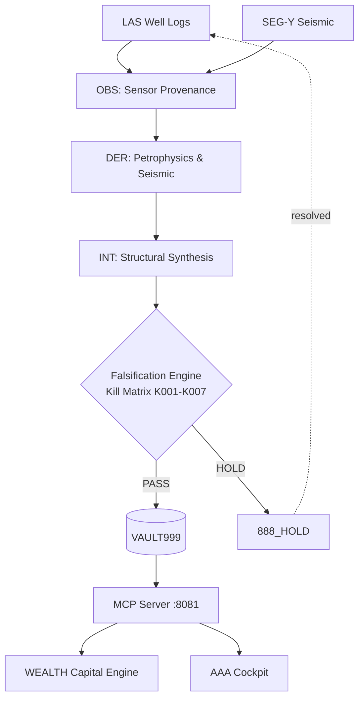
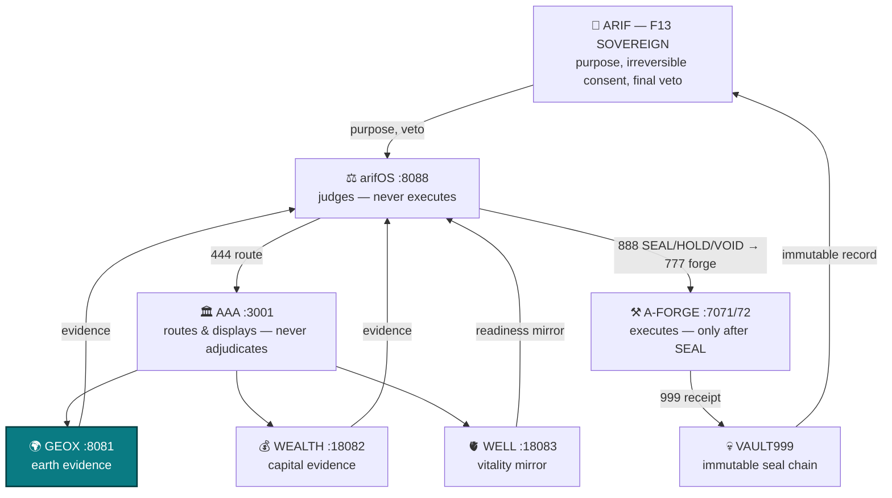
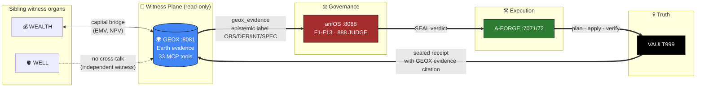

<!-- SOT-MANIFEST
owner: Muhammad Arif bin Fazil (F13 SOVEREIGN)
last_verified: 2026-08-11T05:58:51Z
federation_release: v2026.08.09
live_commit: d79a9b59 (chore(GEOX): ignore pyproject.toml backup files)
truth_rule: live :8081/health + tools/list beat any static count in prose
mcp_tools_live: 33
mcp_apps_registered: 18
chatgpt_metadata: widgetCSP + widgetDescription + domain — VERIFIED
epistemic_standard: OBS / DER / INT / SPEC labels apply to this document itself
symlink_alias: /root/geox (lowercase) → /root/GEOX (canonical, this file)
infra_organs: arifFlow:7073 METABOLISM, FED:7074 ADVISORY, FLAME:18901 ADVISORY, FRAME:frame-organ.service OBSERVE
audit_basis: 333-AGI Δ MIND session (2026-08-11) — 19-repo README audit
-->

# 🌍 GEOX — Earth Intelligence Organ

[](https://github.com/ariffazil/GEOX/actions)
[](https://geox.arif-fazil.com/mcp)
[](https://arifos.arif-fazil.com)
[](./LICENSE)

> **GEOX is the earth witness. It computes geological evidence. It never adjudicates.**
> **DITEMPA BUKAN DIBERI — Truth must cool before it rules.**

<!-- RULE-5 First Fold -->
> **What?** Earth intelligence organ — physics-gated geoscience from basin analysis to prospect evaluation.
> **Why?** Exploration decisions need evidence anchored in physics, not vibes or pattern matching.
> **Care?** Every geological claim carries OBS/DER/INT/SPEC labels and uncertainty bounds — you always know what's measured vs inferred.

**GEOX** is the earth intelligence organ of the arifOS Federation. It computes seismic attributes, well-log petrophysics, basin models, structural analysis, and prospect volumetrics — all under strict epistemic provenance. It bridges raw geoscientific observation to capital decision-making with cryptographic audit trails.

---

## 📐 Epistemic Layering

GEOX enforces explicit segregation between measurement and interpretation:

| Layer | Classification | Meaning | Examples |
|:---:|:---|:---|:---|
| **OBS** | Observed | Direct sensor measurement | LAS wireline logs, SEG-Y trace amplitudes, core data |
| **DER** | Derived | Deterministic physical computation | Effective porosity (φ), Acoustic Impedance (Z), Sw |
| **INT** | Interpreted | Synthesized geological evaluation | Horizons, fault polygons, reservoir-seal-charge |
| **SPEC** | Speculated | Unvalidated assumption | Migration pathways, fluid boundaries, compartmentalization |

---

## 🧪 Falsification-First Architecture — Inner Loop



---

## 🌐 Federation — Outer Loop

GEOX's pipeline above is a witness loop — it computes evidence, never a verdict. The
evidence feeds the federation's outer loop, the whole linked state, one diagram:



**Linked state:** [arifOS](https://github.com/ariffazil/arifos#-federation--outer-loop) ·
[A-FORGE](https://github.com/ariffazil/A-FORGE#-federation--outer-loop) ·
[WEALTH](https://github.com/ariffazil/WEALTH#-federation--outer-loop) ·
[WELL](https://github.com/ariffazil/WELL#-federation--outer-loop) ·
full contract: [`FEDERATION_CONTRACT.md`](./FEDERATION_CONTRACT.md)

---

## 🛠️ Core Capabilities (33 Tools)

| Domain | Capability |
|--------|-----------|
| **Well Logs** | LAS ingestion, Archie/Simandoux Sw, density-neutron porosity, net pay |
| **Seismic** | SEG-Y headers, synthetic seismograms, AVO analysis, spectral decomposition |
| **Structural** | 6-point Malay Basin stress battery, K-DIP normal vectors, fault displacement |
| **Basin Modeling** | Backstripping, thermal maturity, subsidence history |
| **Geomechanics** | Elastic moduli, stress polygon, pore pressure prediction |
| **Prospect** | STOIIP/GIIP volumetrics, POS, seamless WEALTH bridge for EMV |

---

## 🗺️ Where GEOX Sits in the Federation



**GEOX internal loop (claim engine):**

```
observe ───▶ geox_evidence (epistemic label) ───▶ geox_claim (create)
                                                       │
              geox_falsify (Popperian attack)  ◀────────┤
                       │                              │
                       ▼                              ▼
              geox_claim (challenge)        geox_claim (seal candidate)
                                                       │
                                                       ▼
                                              arifOS 888 JUDGE
                                                       │
                                                       ▼
                                              A-FORGE execute → VAULT999
```

**Hard rules:**
- GEOX never adjudicates. Every claim is a **candidate** until arifOS JUDGE renders a verdict.
- GEOX never executes. All mutations flow through A-FORGE under SEAL.
- GEOX never self-cites. Witness organs stay independent — no cross-talk except WEALTH bridge.

**Plus 18 MCP App widgets:** WellDesk · Seismic Vision · Earth Volume · Basin Explorer · Prospect Studio · Risk Console · and more — render inline in ChatGPT, Claude, VS Code.

---

## ⚡ Production Operations

```
Public MCP:    https://geox.arif-fazil.com/mcp
Local Daemon:  http://127.0.0.1:8081
```

```bash
git clone https://github.com/ariffazil/GEOX.git /opt/geox/app
cd /opt/geox/app && uv sync --frozen
PYTHONPATH=src pytest tests/ -q --tb=short
systemctl restart geox-mcp
curl -s http://127.0.0.1:8081/health | jq .
```

---

## 🏛️ Federation Navigation

| Organ | Role | Port | Repo | MCP | Health | LLMs |
|:---|:---|:---:|:---|:---|:---|:---|
| **⚖️ arifOS** | Constitutional Kernel — judges, seals | 8088 | [repo](https://github.com/ariffazil/arifos) | [mcp](https://mcp.arif-fazil.com/mcp) | [health](https://arifos.arif-fazil.com/health) | [llms.txt](https://arifos.arif-fazil.com/llms.txt) |
| **⚒️ A-FORGE** | Execution Engine — builds, deploys | 7071/72 | [repo](https://github.com/ariffazil/A-FORGE) | [mcp](https://forge.arif-fazil.com/mcp) | [health](https://forge.arif-fazil.com/health) | [llms.txt](https://forge.arif-fazil.com/llms.txt) |
| **🏛️ AAA** | Control Plane — A2A gateway, cockpit | 3001 | [repo](https://github.com/ariffazil/AAA) | — | [health](https://aaa.arif-fazil.com/health) | [llms.txt](https://aaa.arif-fazil.com/llms.txt) |
| **🌍 GEOX** | Earth Intelligence — seismic, wells | 8081 | [repo](https://github.com/ariffazil/GEOX) | [mcp](https://geox.arif-fazil.com/mcp) | [health](https://geox.arif-fazil.com/health) | [llms.txt](https://geox.arif-fazil.com/llms.txt) |
| **💰 WEALTH** | Capital Intelligence — NPV, risk | 18082 | [repo](https://github.com/ariffazil/WEALTH) | [mcp](https://wealth.arif-fazil.com/mcp) | [health](https://wealth.arif-fazil.com/health) | (llms.txt pending) |
| **🫀 WELL** | Vitality Guard — human readiness | 18083 | [repo](https://github.com/ariffazil/WELL) | [mcp](https://well.arif-fazil.com/mcp) | [health](https://well.arif-fazil.com/health) | [llms.txt](https://well.arif-fazil.com/llms.txt) |
| **🫀 arifFlow** | Metabolism — FQ pulse, receipts | 7073 | [repo](https://github.com/ariffazil/arifFlow) | — | [health](https://arifflow.arif-fazil.com/health) | — |
| **🧭 FED** | Route Advisor — model/provider ranking | 7074 | private (internal) | — | [health](https://fed.arif-fazil.com/health) | — |
| **🔥 FLAME** | RM0 Inference — free-loop model mesh | 18901 | private (internal) | — | [health](https://flame.arif-fazil.com/health) | — |
| **🧱 FRAME** | Substrate — federation scaffolding | frame-organ.service | private (internal) | — | — | — |
| **🔮 HERMES** | Multi-Modal Bridge — Telegram relay | 8644 | [repo](https://github.com/ariffazil/HERMES) | — | — | — |
| **🌐 arif-fazil.com** | Public Web Surface — one domain | 443 | [repo](https://github.com/ariffazil/arif-fazil.com) | — | [verify](https://arif-fazil.com/999/verify) | — |

---

## 📡 MCP Registries

GEOX is registered as an MCP server on the federation registries. Discovery metadata is exposed at each endpoint.

| Registry | Server | Manifest |
|----------|--------|----------|
| **Glama** | ⚠️ 301 → [glama.ai/mcp/servers/ariffazil/arifos](https://glama.ai/mcp/servers/ariffazil/arifos) | GEOX uses arifOS umbrella |
| **TurboMCP** | ❌ 404 (2026-08-11) | Federation-wide entry — was `turbomcp.ai/server/ariffazil/arifos`, now dead |

Discovery endpoint: `GET https://geox.arif-fazil.com/.well-known/mcp/server.json`

---

## 📜 License & Sovereignty

- **License:** Business Source License 1.1 (**BSL-1.1**), converting to Apache 2.0 on 2029-06-29
- **Sovereign:** **Muhammad Arif bin Fazil** (F13 SOVEREIGN)

> *DITEMPA BUKAN DIBERI — Forged, Not Given.*  
> *Maintained under F13. Built on Marmousi, validated on Volve. 999 SEAL ALIVE.*
