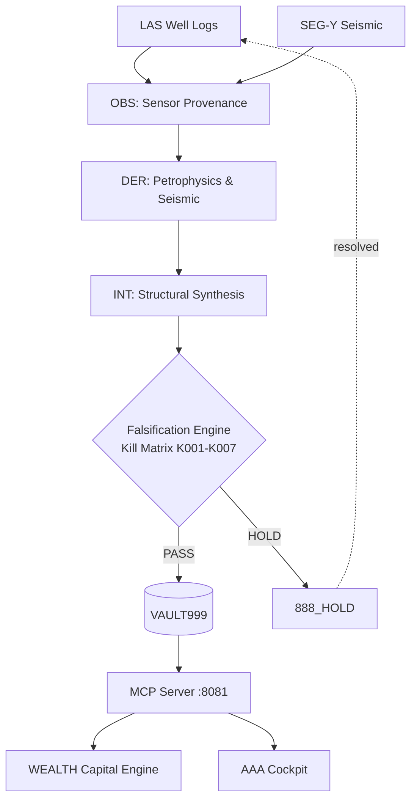
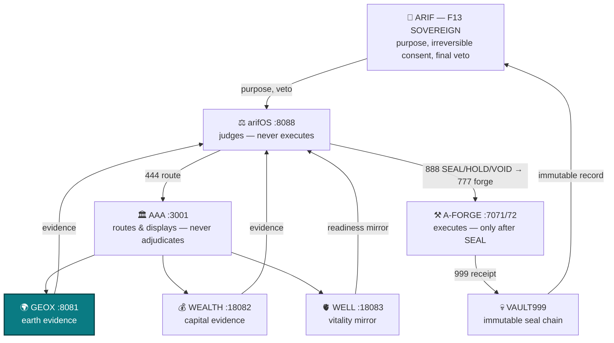

<!-- SOT-MANIFEST
owner: Muhammad Arif bin Fazil (F13 SOVEREIGN)
last_verified: 2026-08-10T12:10:00Z
federation_release: v2026.08.09
live_commit: 8e3de899 (M6 instrumentation — per-tool invocation counters)
truth_rule: live :8081/health + tools/list beat any static count in prose
mcp_tools_live: 33
mcp_apps_registered: 18
chatgpt_metadata: widgetCSP + widgetDescription + domain — VERIFIED
epistemic_standard: OBS / DER / INT / SPEC labels apply to this document itself
-->

# 🌍 GEOX — Earth Intelligence Organ

[](https://github.com/ariffazil/GEOX/actions)
[](https://geox.arif-fazil.com/mcp)
[](https://arifos.arif-fazil.com)
[](./LICENSE)

> **GEOX is the earth witness. It computes geological evidence. It never adjudicates.**
> **DITEMPA BUKAN DIBERI — Truth must cool before it rules.**

**GEOX** is the earth intelligence organ of the arifOS Federation. It computes seismic attributes, well-log petrophysics, basin models, structural analysis, and prospect volumetrics — all under strict epistemic provenance. It bridges raw geoscientific observation to capital decision-making with cryptographic audit trails.

---

## 📐 Epistemic Layering

GEOX enforces explicit segregation between measurement and interpretation:

| Layer | Classification | Meaning | Examples |
|:---:|:---|:---|:---|
| **OBS** | Observed | Direct sensor measurement | LAS wireline logs, SEG-Y trace amplitudes, core data |
| **DER** | Derived | Deterministic physical computation | Effective porosity (φ), Acoustic Impedance (Z), Sw |
| **INT** | Interpreted | Synthesized geological evaluation | Horizons, fault polygons, reservoir-seal-charge |
| **SPEC** | Speculated | Unvalidated assumption | Migration pathways, fluid boundaries, compartmentalization |

---

## 🧪 Falsification-First Architecture — Inner Loop



---

## 🌐 Federation — Outer Loop

GEOX's pipeline above is a witness loop — it computes evidence, never a verdict. The
evidence feeds the federation's outer loop, the whole linked state, one diagram:



**Linked state:** [arifOS](https://github.com/ariffazil/arifos#-federation--outer-loop) ·
[A-FORGE](https://github.com/ariffazil/A-FORGE#-federation--outer-loop) ·
[WEALTH](https://github.com/ariffazil/WEALTH#-federation--outer-loop) ·
[WELL](https://github.com/ariffazil/WELL#-federation--outer-loop) ·
full contract: [`FEDERATION_CONTRACT.md`](./FEDERATION_CONTRACT.md)

---

## 🛠️ Core Capabilities (33 Tools)

| Domain | Capability |
|--------|-----------|
| **Well Logs** | LAS ingestion, Archie/Simandoux Sw, density-neutron porosity, net pay |
| **Seismic** | SEG-Y headers, synthetic seismograms, AVO analysis, spectral decomposition |
| **Structural** | 6-point Malay Basin stress battery, K-DIP normal vectors, fault displacement |
| **Basin Modeling** | Backstripping, thermal maturity, subsidence history |
| **Geomechanics** | Elastic moduli, stress polygon, pore pressure prediction |
| **Prospect** | STOIIP/GIIP volumetrics, POS, seamless WEALTH bridge for EMV |

**Plus 18 MCP App widgets:** WellDesk · Seismic Vision · Earth Volume · Basin Explorer · Prospect Studio · Risk Console · and more — render inline in ChatGPT, Claude, VS Code.

---

## ⚡ Production Operations

```
Public MCP:    https://geox.arif-fazil.com/mcp
Local Daemon:  http://127.0.0.1:8081
```

```bash
git clone https://github.com/ariffazil/GEOX.git /opt/geox/app
cd /opt/geox/app && uv sync --frozen
PYTHONPATH=src pytest tests/ -q --tb=short
systemctl restart geox-mcp
curl -s http://127.0.0.1:8081/health | jq .
```

---

## 🏛️ Federation Navigation

| Organ | Role | Port | Repo | MCP | Health | LLMs |
|:---|:---|:---:|:---|:---|:---|:---|
| **⚖️ arifOS** | Constitutional Kernel — judges, seals | 8088 | [repo](https://github.com/ariffazil/arifos) | [mcp](https://mcp.arif-fazil.com/mcp) | [health](https://arifos.arif-fazil.com/health) | [llms.txt](https://arifos.arif-fazil.com/llms.txt) |
| **⚒️ A-FORGE** | Execution Engine — builds, deploys | 7071/72 | [repo](https://github.com/ariffazil/A-FORGE) | [mcp](https://forge.arif-fazil.com/mcp) | [health](https://forge.arif-fazil.com/health) | [llms.txt](https://forge.arif-fazil.com/llms.txt) |
| **🏛️ AAA** | Control Plane — A2A gateway, cockpit | 3001 | [repo](https://github.com/ariffazil/AAA) | — | [health](https://aaa.arif-fazil.com/health) | [llms.txt](https://aaa.arif-fazil.com/llms.txt) |
| **🌍 GEOX** | Earth Intelligence — seismic, wells | 8081 | [repo](https://github.com/ariffazil/GEOX) | [mcp](https://geox.arif-fazil.com/mcp) | [health](https://geox.arif-fazil.com/health) | [llms.txt](https://geox.arif-fazil.com/llms.txt) |
| **💰 WEALTH** | Capital Intelligence — NPV, risk | 18082 | [repo](https://github.com/ariffazil/WEALTH) | [mcp](https://wealth.arif-fazil.com/mcp) | [health](https://wealth.arif-fazil.com/health) | [llms.txt](https://wealth.arif-fazil.com/llms.txt) |
| **🫀 WELL** | Vitality Guard — human readiness | 18083 | [repo](https://github.com/ariffazil/WELL) | [mcp](https://well.arif-fazil.com/mcp) | [health](https://well.arif-fazil.com/health) | [llms.txt](https://well.arif-fazil.com/llms.txt) |
| **🔮 HERMES** | Multi-Modal Bridge — Telegram relay | 8644 | [repo](https://github.com/ariffazil/HERMES) | — | — | — |
| **🌐 arif-fazil.com** | Public Web Surface — one domain | 443 | [repo](https://github.com/ariffazil/arif-fazil.com) | — | [verify](https://arif-fazil.com/999/verify) | — |

---

## 📡 MCP Registries

GEOX is registered as an MCP server on the federation registries. Discovery metadata is exposed at each endpoint.

| Registry | Server | Manifest |
|----------|--------|----------|
| **Glama** | [glama.ai/mcp/servers/ariffazil/geox](https://glama.ai/mcp/servers/ariffazil/geox) | `https://geox.arif-fazil.com/.well-known/glama.json` |
| **Smithery** | [smithery.ai/server/geox](https://smithery.ai/server/geox) | `https://geox.arif-fazil.com/.well-known/smithery.yaml` |
| **mcp.so** | [mcp.so/server/ariffazil/geox](https://mcp.so/server/ariffazil/geox) | `https://geox.arif-fazil.com/.well-known/mcp-so.json` |

Discovery endpoint: `GET https://geox.arif-fazil.com/.well-known/mcp/server.json`

---

## 📜 License & Sovereignty

- **License:** Business Source License 1.1 (**BSL-1.1**), converting to Apache 2.0 on 2029-06-29
- **Sovereign:** **Muhammad Arif bin Fazil** (F13 SOVEREIGN)

> *DITEMPA BUKAN DIBERI — Forged, Not Given.*  
> *Maintained under F13. Built on Marmousi, validated on Volve. 999 SEAL ALIVE.*

---

## 🛡️ CI Governance (F13 verdict 2026-08-10)

This repo follows the federation's CI governance pattern (replicated from `ariffazil/arifOS` PR #683). The pattern ensures Dependabot PRs receive a real, reproducible unprivileged verdict — no more all-red check rolls from structurally-incompatible gates.

**Per-repo adapter** (see `.github/workflows/` for the actual files):

- `.github/dependabot.yml` — `uv` (Python) / `cargo` (Rust) / `npm` (TypeScript) ecosystem; cooldown 3d; open-PRs 5; constitutional packages un-grouped (no `ignore:` — visibility preserved)
- `.github/workflows/dependabot-ci.yml` — unprivileged gate; runs ONLY on Dependabot PRs; SHA-bound probes
- `.github/workflows/{ci-uv-lock-invariant|cargo-lock-invariant|npm-lock-invariant}.yml` — universal `{uv lock --check && uv sync --frozen | cargo check --locked && cargo build --locked | npm ci}` invariant on every PR + push to main
- `.github/workflows/auto-merge-dependabot.yml` — constitutional package denylist (per-language); F13 review the only merge path
- Privileged workflows gated with `if: github.actor != 'dependabot[bot]' && github.actor != 'app/dependabot'` — so they SKIP for Dependabot PRs where their inputs cannot be satisfied

**Constitutional packages** (denied auto-merge, require F13 review):

| Language | Denylist |
|---|---|
| Python | `protobuf`, `cryptography`, `fastmcp-slim`, `fastmcp`, `caio`, `sentence-transformers`, `pynacl`, `blake3` |
| Rust    | `serde`, `tokio`, `hyper`, `axum`, `reqwest`, `rustls`, `async-trait`, `clap`, `tracing` |
| TypeScript | `zod`, `@modelcontextprotocol/sdk`, `fastmcp`, `mcp-sdk`, `tsx`, `vitest`, `@types/node`, `typescript`, `ts-node` |
| Static site | `vite`, `react`, `react-dom`, `react-router`, `@tanstack/react-query`, `tailwindcss` |

**Reference:** [`/root/AGENTS.md`](/root/AGENTS.md) — canonical federation doctrine. `AAA/docs/ORGAN.md` — topology.

DITEMPA BUKAN DIBERI — governance is forged, not given.
