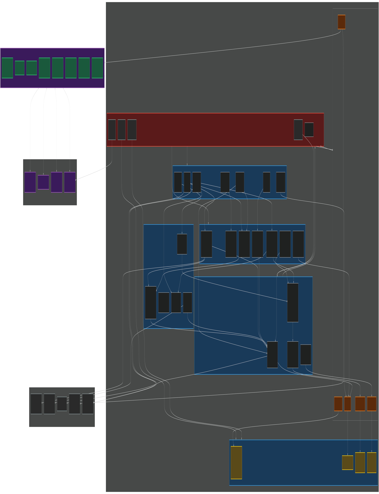
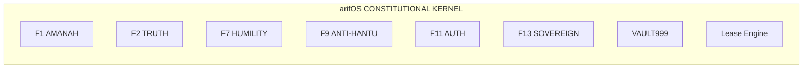

# GEOX Large Earth Model — Forge Blueprint v1

**Date:** 2026-06-14  
**Author:** FORGE (000Ω), distilled from Arif's doctrine  
**Framework:** arifOS constitutional federation  
**Doctrine:** Physics > narrative. Visual-spatial-first > text-first. Provenance > convenience. Typed uncertainty > scalar confidence. Governed action > raw output.

---

## Core Doctrine — Corrected

> **GEOX turns raw Earth evidence into visual-spatial objects, physics-checked tensors, and falsifiable claims under arifOS law.**

**Text is the legal/explanatory wrapper. Visual-spatial is the native language.**

Earth is not a paragraph. Earth is:

```
map          section        cube          surface
fault plane  well trajectory log curve    amplitude anomaly
pressure gradient           basin boundary uncertainty cloud
time/depth volume           core photo    thin section
```

The pipeline:

```
VISUAL EARTH STATE
→ numerical evidence
→ physics checks  
→ claim text
→ arifOS verdict
```

Not:

```
text summary → maybe a picture later
```

---

## Visual Architecture

> *Full architecture diagram (3840×4800 PNG):*  
> `docs/GEOX_LEM_ARCHITECTURE_VISUAL.png`  
> *Mermaid source:* `docs/GEOX_LEM_ARCHITECTURE_VISUAL.mmd`  
> *SVG export:* `docs/GEOX_LEM_ARCHITECTURE_VISUAL.svg`



The diagram shows the full stack: arifOS constitutional kernel at the top, the 5-layer GEOX LEM runtime in the middle (Raw Witness → Physics → Learned Representations → Knowledge Graph → Governed Surface), the **Visual Engine** (red, newly added) cross-cutting all layers, the Claim Engine as the crown, federation organs on the right, and data infrastructure at the bottom. Every arrow is a data or decision flow.



*Interactive Mermaid source in `GEOX_LEM_ARCHITECTURE_VISUAL.mmd` — render with any Mermaid viewer.*

---

## Core Seal

> **GEOX is not a geoscience chatbot. GEOX is the Earth organ of arifOS — a governed Large Earth Model that turns raw Earth evidence into visual-spatial objects, physics-checked tensors, and falsifiable claims under arifOS law.**

A normal AI agent says: *"Maybe this is a reservoir."*

A real GEOX says:

```yaml
This reservoir claim depends on:
  wells: [A-1, A-2]
  logs: [GR, RHOB, NPHI, RT] → ingested + QC_VERIFIED
  seismic: survey_MAL_3D → amplitude anomaly tied within 12 ms
  CRS: EPSG:3168 (Timbalai 1948)
  depth_datum: MSL, TVDSS (±2 m)
  pressure_evidence: DST #3 → gas gradient 0.15 psi/ft
  uncertainty_range: P10=12m, P50=21m, P90=34m net pay
  failure_modes: [low-density shale, coal, tuning artifact]
  physics_guard: PASS (Archie Sw=0.23, Vp/Vs=1.6)
  arifOS_authority: QUALIFY (not yet SEAL; missing PVT)
```

That is the difference between **AI theatre** and **Earth intelligence**.

---

## I. External Landscape — What the World Is Doing

### Earth System Foundation Models

| Source | Key Insight | GEOX Relevance |
|--------|-------------|----------------|
| **Nature Comms Earth & Env (2026)** | 11 features for ideal Earth FM: geolocation, scale awareness, multisensor, time awareness, uncertainty, physical consistency | We have governance/uncertainty. Need: geolocation CRS, multiscale, multisensor typing |
| **Google Earth AI (2026)** | 3 FM families (Imagery, Population, Environment) + Gemini reasoning agent | We already have this pattern: GEOX + WEALTH + WELL + arifOS orchestration |
| **Prithvi-EO-2.0 (NASA/IBM)** | 300M/600M params. Multi-temporal + location embeddings. 4.2M samples at 30m. | Pattern: temporal + location embeddings. GEOX needs depth embeddings too |
| **AlphaEarth Foundations** | Global embedding field from sparse labels → maps | Subsurface is sparse-label mapping: few wells, expensive labels, noisy seismic |
| **Aurora (Microsoft, Nature 2025)** | Single FM outperforms operational systems across air, ocean, weather | North Star for LEM — but requires data abundance GEOX doesn't have yet |
| **GraphCast / FourCastNet** | Learned weather simulators, fast inference, cheap ensembles | Pattern: learned simulator for physics, not replacement of physics |

### Subsurface Foundation Models

| Source | Key Insight | GEOX Relevance |
|--------|-------------|----------------|
| **Transparent Earth (LANL, 2025)** | Transformer + modality encodings + spatial coordinates → predict any subsurface property anywhere | Architecture insight: modality encodings for typed Earth data |
| **WLFM (2025)** | VQ-tokenized well logs → geological vocabulary. Masked token + stratigraphy contrastive learning | Directly usable. Phase 3 of LEM roadmap |
| **GEM 3D (2025)** | Prompt-conditioned structural inference. Well logs, masks, sketches → coherent 3D output | Pattern: promptable subsurface reasoning. Future GEOX capability |
| **SFM (Seismic Foundation Model)** | Self-supervised on seismic waveforms → fault segmentation, inversion | Phase 3 integration candidate |

### Standards & Enterprise

| Standard | Relevance |
|----------|-----------|
| **OSDU** | Interpretations as data with lineage, not files. Enterprise data spine for subsurface |
| **Energistics (WITSML/RESQML/PRODML/ETP)** | Upstream data language. Wells, reservoirs, production, transfer |
| **SEG-Y Rev 2.1** | Standard seismic exchange. Byte-order, IBM/IEEE float, coordinate scalar handling |
| **LAS 2.0 / 3.0** | Standard well-log format. Curve aliasing, unit handling, depth validation |
| **OGC API - Features / GeoPackage** | Geospatial interoperability. CRS, features, export |
| **MCP (2025-11-25)** | Tool protocol. Must obey: registry truth, schema truth, runtime truth, governance truth |

---

## II. Core Architecture — GEOX as Earth State Machine

The deepest external insight from all sources: **GEOX should not be one model. It should be a runtime that hosts models.**

```
                    ┌─────────────────────────────────────────────┐
                    │          arifOS CONSTITUTIONAL KERNEL          │
                    │  (F1-F13, identity, lease, authority, vault)  │
                    └──────────────────────┬──────────────────────┘
                                           │ contracted decision envelopes
                                           ▼
┌─────────────────────────────────────────────────────────────────┐
│                    GEOX LARGE EARTH MODEL RUNTIME                  │
├─────────────────────────────────────────────────────────────────┤
│                                                                   │
│  Layer E: GOVERNED DECISION SURFACE                               │
│  ┌─────────────────────────────────────────────────────────────┐ │
│  │ ACRisk (typed uncertainty) │ HOLD/SEAL/VOID │ action gate  │ │
│  │ reversibility_class       │ authority_tier  │              │ │
│  └─────────────────────────────────────────────────────────────┘ │
│                                                                   │
│  Layer D: EARTH KNOWLEDGE GRAPH                                   │
│  ┌─────────────────────────────────────────────────────────────┐ │
│  │ spatial (well INTERSECTS formation)                         │ │
│  │ stratigraphic (formation TIES_TO marker CALIBRATES horizon) │ │
│  │ temporal (claim SUPERSEDES claim)                           │ │
│  │ provenance (observation DERIVED_FROM survey)                │ │
│  └─────────────────────────────────────────────────────────────┘ │
│                                                                   │
│  Layer C: LEARNED REPRESENTATIONS                                 │
│  ┌─────────────────────────────────────────────────────────────┐ │
│  │ VQ-log tokens │ seismic patch embeddings │ cross-modal      │ │
│  │ masked token transformer │ stratigraphy contrastive         │ │
│  └─────────────────────────────────────────────────────────────┘ │
│                                                                   │
│  Layer B: DETERMINISTIC PHYSICS ENGINES                           │
│  ┌─────────────────────────────────────────────────────────────┐ │
│  │ petrophysics │ rock physics │ well tie │ pressure gradient │ │
│  │ AVO │ fault seal │ basin charge │ volumetrics │ Monte Carlo │ │
│  └─────────────────────────────────────────────────────────────┘ │
│                                                                   │
│  Layer A: RAW WITNESS                                             │
│  ┌─────────────────────────────────────────────────────────────┐ │
│  │ LAS │ SEG-Y │ checkshot │ VSP │ tops │ cores │ DST │ PVT   │ │
│  │ mud logs │ core photos │ thin sections │ maps │ papers      │ │
│  └─────────────────────────────────────────────────────────────┘ │
│                                                                   │
└─────────────────────────────────────────────────────────────────┘
```

**Eureka:** This 5-layer stack is the exact complementary shape to arifOS:

- **arifOS decides:** *who* can act, *whether* the action is lawful (F1-F13)
- **GEOX decides:** *what is true about Earth*, *how certain we are*, *what evidence supports it*
- **Join point:** Contracted decision envelopes

---

## III. The 5 Primitives — Everything Is One of These

| Primitive | Definition | Examples | Must Carry | Stored In |
|-----------|-----------|----------|------------|-----------|
| **Entity** | A persistent real-world object with identity | Well, Wellbore, Survey, Volume, Horizon, Fault, Formation, Basin, Play | UUIDv7, canonical name, spatial extent, version lineage | Postgres (L4 structured) |
| **Observation** | A raw measurement at a time and place | LAS file, SEG-Y volume, core photo, DST report, pressure point | Artifact ID, sensor context, sample rate, raw values, unit registry, CRS, depth basis, depth datum | Object store (S3/disk) + Qdrant (L3 semantic) |
| **Derivation** | A deterministic transform from inputs to outputs | Vsh curve, porosity log, AI volume, pressure gradient | Formula, assumptions, input refs, parameters, uncertainty per sample, sensitivity | Postgres + VAULT999 |
| **Interpretation** | A human/machine hypothesis about Earth | Horizon pick, facies log, seal assessment, prospect evaluation | Claim ID, evidence-for, evidence-against, missing tests, author, status, supersedes | Graphiti (L5) + VAULT999 |
| **Decision Artifact** | A risk-ranked recommendation bound to authority | Drill/no-drill, prospect ranking, seal verdict | Authority tier, reversibility class, ACRisk, missing evidence, next-best-test | VAULT999 (L6 immutable) |

### The OSDU Lesson Applied Correctly

OSDU's strongest insight: **interpretations are data with lineage, not screenshots inside vendor tools.**

GEOX goes further: **uncertainty, contradiction, and authority must be data too.**

---

## IV. Layer A: Raw Witness — Artifact Store

### Current GEOX: ✅ Partial

- `geox_data_ingest_bundle` — LAS, CSV, Parquet, SEG-Y ✅
- `geox_las_inspect` — LAS header/curve validation ✅ (fixed)
- `geox_seismic_segy_inspect` — SEG-Y header validation ✅ (fixed)
- `geox_header_inspect` — Unified format inspection ✅
- `geox_data_qc_bundle` — Depth monotonicity, null %, physical ranges ✅
- `geox_dst_ingest_test` — DST structured ingestion ✅

### Gap: Artifacts not hashed as immutable records

**Forge:** `geox-artifact-store` module

```sql
CREATE TABLE earth_artifact (
    artifact_id       TEXT PRIMARY KEY,          -- sha256(content)
    source_type       TEXT NOT NULL,             -- LAS | SEG-Y | DST | PVT | MAP | CORE | PAPER
    source_uri        TEXT,                      -- original file path / URL
    content_hash      TEXT NOT NULL,             -- sha256 of raw bytes
    parser_version    TEXT NOT NULL,             -- which parser forged this
    license           TEXT,                      -- data license
    owner             TEXT,                      -- who contributed
    crs               TEXT,                      -- EPSG code or WKT
    vertical_crs      TEXT,                      -- vertical coordinate reference
    depth_basis       TEXT,                      -- MD | TVD | TVDSS | TWT
    depth_datum       TEXT,                      -- KB | DF | MSL | LAT
    unit_system       TEXT,                      -- metric | imperial | mixed
    qc_state          TEXT NOT NULL DEFAULT 'RAW',  -- RAW | INSPECTED | QC_VERIFIED | REJECTED
    created_at        TIMESTAMPTZ NOT NULL DEFAULT NOW(),
    metadata          JSONB                      -- parser-specific metadata
);

CREATE INDEX idx_artifact_type ON earth_artifact(source_type);
CREATE INDEX idx_artifact_qc ON earth_artifact(qc_state);
```

**Rule:** No claim without artifact_ref. No artifact without hash. No hash without parser version.

---

## V. Layer B: Physics Engines — Deterministic Earth

### Current GEOX: ⚠️ Swiss-army knife

- `geox_subsurface_generate_candidates` — Does everything (Vsh, porosity, saturation, net pay, lithology, GR motif) as one tool
- `geox_seismic_compute` — Synthetic, well tie, time-depth, anomalous contrast, attribute
- `geox_prospect_evaluate` — Volumetrics, POS, EVOI with evidence gating

**Gap:** No standalone, modular petrophysics. All bundled into one "candidates" tool.

**Forge:** Standalone physics tools

```
geox_petrophysics_vsh          — GR, SP, neutron methods (linear, Larionov, Clavier, Steiber)
geox_petrophysics_porosity     — density, neutron, sonic (Wyllie, Raymer-Hunt, CRIM)
geox_petrophysics_saturation   — Archie, Simandoux, Indonesia, Waxman-Smits
geox_petrophysics_netpay       — Cutoff sensitivity, net-to-gross, pay flagging
geox_pressure_gradient         — Fluid gradient, contacts, overpressure detection
geox_rock_physics              — VP/VS, elastic moduli, Gassmann fluid substitution
geox_volumetrics               — Monte Carlo with correlation, tornado, sensitivity
geox_well_tie                  — Synthetic trace, correlation, stretch/squeeze
geox_fault_seal_screen         — SGR, shale smear, juxtaposition
```

**Eureka from WLFM:** Physics engines should accept **both raw curves AND VQ tokens** as input. This keeps deterministic path fast and learned path adaptive.

### Every Physics Tool Must Emit

```yaml
equations_used:   ["Archie: Sw = (a * Rw) / (phi^m * Rt)^(1/n)"]
assumptions:      ["a=1.0", "m=2.0", "n=2.0", "Rw=0.05 @ formation temp"]
limitations:      ["Does not account for clay conductivity", "Assumes clean sand"]
input_hash:       sha256:...
output_hash:      sha256:...
sensitivity_to:   ["Rw ±0.02 → Sw ±0.08", "m ±0.2 → Sw ±0.12"]
claim_state:      COMPUTED
evidence_state:   NO_EXTERNAL_EVIDENCE
```

---

## VI. Layer C: Learned Representations — WLFM-Style Tokens

### Current GEOX: ❌ Absent

**Gap:** No learned representations at all.

### Forge: Well Log VQ Tokenizer (WLFM Pattern)

The WLFM insight: convert multi-curve log patches into **discrete tokens** via vector quantization. This:
1. Creates a **geological vocabulary** — recurring morphologies (shale-sand transitions, high-resistivity intervals)
2. Enables **partial reconstruction** — predict missing curves from present ones
3. Provides **shared embedding surface** for cross-modal alignment (logs ↔ seismic ↔ text)

### Forge Order

| Step | Component | Description |
|------|-----------|-------------|
| 1 | VQ tokenizer | Multi-curve patches → discrete tokens. Train on all GEOX LAS corpus |
| 2 | Masked token transformer | Geology-aware pretraining. Predict masked tokens from context |
| 3 | Stratigraphy contrastive | Pull same-formation intervals together, push different formations apart |
| 4 | Seismic patch encoder | 2D patches → tokens. Align with log tokens via contrastive loss |
| 5 | Text encoder | Well reports, completion reports → tokens. Align with log/seismic |
| 6 | Cross-modal retrieval | Log motif ↔ seismic facies ↔ text description. Qdrant as embedding store |

### Why Not One Giant Model?

Earth is too heterogeneous. Use a **model federation**, not one god model:

```
seismic encoder (SFM-style)
well-log encoder (WLFM-style)  
satellite encoder (Prithvi-style)
document encoder (NLP)
geometry encoder (coordinate-aware)
physics simulator (deterministic)
claim reasoner (graph-based)
```

Align them in a shared latent space. Do not force one architecture.

---

## VII. Layer D: Earth Knowledge Graph

### Current GEOX: ❌ Absent

**Gap:** GEOX has Graphiti available (FalkorDB) but doesn't use it.

### Forge: `geox-earth-graph`

**Node types:**

```
Well, Wellbore, LogCurve, LogInterval, FormationTop,
Horizon, Fault, FaultBlock, Trap, Reservoir, Seal,
SourceRock, MigrationPathway, FluidContact, PressurePoint,
DST, PVT, SeismicVolume, SeismicAttribute,
Claim, AlternativeInterpretation, Decision
```

**Edge types:**

```
observed_by        — artifact was captured by a sensor
derived_from       — artifact was computed from another
supports           — evidence supports a claim
contradicts        — evidence contradicts a claim
calibrates         — measurement calibrates a model
ties_to            — well pick ties to seismic horizon
above / below      — stratigraphic order
cuts               — fault cuts formation
seals              — formation provides seal for trap
charges            — source rock charges reservoir
contains           — basin contains play, play contains prospect
supersedes         — v2 interpretation replaces v1
uncertain_with     — two interpretations are alternatives
```

### Each Edge Carries

```yaml
spatial_confidence:      0.0-1.0  (how well do coordinates align?)
stratigraphic_confidence: 0.0-1.0  (is the formation pick solid?)
temporal_validity:        "active" | "superseded" | "provisional"
provenance:               "author: FORGE, timestamp: 2026-06-14"
```

### The Graph Is Not for Queries Alone

The graph is for **contradiction detection**. If well A says formation is sand and well B says shale at the same stratigraphic level, the graph flags a paradox.

**Eureka:** The graph layer is the moat. Anyone can train a log transformer. Building a versioned, provenance-preserving Earth graph that spans wells → formations → basins → plays → claims → decisions is the hard, valuable work.

---

## VIII. Layer E: Governed Decision Surface

### Current GEOX: ✅ Strong Foundation

- ACRisk computation (`U_phys × D_transform × B_cog`) ✅
- Evidence gating (appraise blocks without evidence) ✅
- HOLD/SEAL/VOID verdicts ✅
- Risk tiering (READONLY, C1, C2, IRREVERSIBLE) ✅

### Gap: Untyped uncertainty

**Current:** `confidence: 0.87` — meaningless. What does 0.87 mean?

**Forge:** Typed uncertainty per claim

```yaml
uncertainty:
  u_obs:       0.05    # measurement noise (sensor precision, calibration drift)
  u_transform: 0.15    # model error (Archie a,m,n uncertainty, Vsh model choice)
  u_interp:    0.20    # interpretation ambiguity (channel vs lobe?)
  u_extrap:    0.35    # spatial generalisation (how far from nearest well?)
  u_action:    0.10    # operational risk (cost of being wrong vs value of being right)

acrisk: 0.48           # computed composite: f(u_obs, u_transform, u_interp, u_extrap, u_action)
```

**Rule:** "80% confident" is useless. "80% confident in Vsh, but 40% confident in sand extent because only 2 wells penetrate" is actionable.

### Failure Modes Must Be Explicit

Every claim must list:

```yaml
failure_modes:
  - "Low-density shale (GR low but density also low — ambiguous)"
  - "Coal (high resistivity but very low density)"
  - "Tuning artifact (amplitude high but below tuning thickness)"
missing_evidence:
  - "DST in zone X would resolve gas vs water"
  - "AVO inversion at crest would confirm fluid"
next_best_test: "Pressure gradient + PVT sampling"
```

---

## IX. The arifOS Complement — Constitutional Coupling

### Clean Separation of Concerns

| Concern | Owner | Why |
|---------|-------|-----|
| **Who can act** | arifOS | Identity, lease, authority classes |
| **Is the action lawful** | arifOS | F1-F13 floors, reversible/irreversible gate |
| **What is true about Earth** | GEOX | Evidence + physics + graph + claim engine |
| **How certain we are** | GEOX | Typed uncertainty + ACRisk composite |
| **What is worth doing** | WEALTH | Capital intelligence, expected value, risk |
| **Is the human ready** | WELL | Vitality, fatigue, dignity, sovereign entropy |
| **Immutable record** | VAULT999 | Both GEOX and arifOS can write |
| **Temporary reasoning** | Agents (Hermes, OpenClaw, OpenCode) | Never source of truth |

### The Join Point — Contracted Decision Envelope

```json
{
  "earth_verdict": "reservoir_candidate | seal_uncertain | trap_unconfirmed",
  "confidence_band": [0.3, 0.7],
  "acrisk": 0.45,
  "missing_tests": ["DST in zone X", "AVO inversion at crest"],
  "authority_required": "C3",
  "reversibility_class": "reversible",
  "supersedes": "claim_abc_123",
  "evidence_refs": [
    "sha256:las_a1_2024",
    "sha256:seismic_mal_3d_2023"
  ]
}
```

**The contract:** GEOX computes, arifOS judges, Arif decides.

---

## X. Core Doctrine: "Earth Claims Are Not Answers"

**GEOX's core principle:**

> An Earth claim is a bounded, evidence-linked, physically constrained hypothesis.

Not:

> "The model says reservoir."

But:

> "The reservoir interpretation is supported by GR/RHOB/NPHI response, constrained by seismic amplitude/coherence, calibrated by checkshot, weakened by missing DST, and held at HYPOTHESIS until pressure/PVT evidence arrives."

### The 5 States of Earth Truth

GEOX must never confuse:

| State | Meaning | Example |
|-------|---------|---------|
| **COMPUTED** | Mathematically produced | "Vsh = 0.23 via linear GR" |
| **VERIFIED** | Cross-checked against evidence | "Vsh 0.23 matches density-neutron crossover" |
| **INTERPRETED** | Geologically inferred | "This is a distributary channel" |
| **SEALED** | Constitutionally accepted | "Prospect A ranked above B for drilling" |
| **VOID** | Retracted or falsified | "New well shows this is shale, not sand" |

---

## XI. What GEOX Must Not Become

### Trap 1: The "LLM Wrapper Over Files"

**Weak pattern:** PDF + LAS + SEG-Y summaries → LLM answer.

**Real pattern:** Parse → hash → normalize → QC → graph → compute physics → create claim → guard → seal. Every step auditable.

### Trap 2: "One Big Model Solves Earth" Fantasy

Earth is too heterogeneous. Use **model federation**, not one god model. Align encoders in shared latent space, don't force one architecture.

### Trap 3: Confidence Theatre

Never output "confidence: 0.87" without showing what evidence moved that number. Confidence must come from: data quality × modality agreement × physics consistency × spatial support × analogue support × alternative interpretations × uncertainty propagation.

### Trap 4: Silent Coordinate Conversion

Never silently convert CRS, units, or datum. Every transform must be visible with source, target, method, and residual.

### Trap 5: Model Output as Truth

Foundation model output is not fact. It is a **candidate witness**. Label it `FM_SUGGESTION`, then force through: QC → physics guard → evidence check → claim engine → arifOS.

---

## XII. Forge Modules A-J — Engineering Plan

### Module A — `geox-artifact-store`

**Purpose:** Immutable Earth evidence with full provenance.

| Status | Component |
|--------|-----------|
| ❌ | Earth artifact table (Postgres) |
| ❌ | Artifact hashing on ingest |
| ❌ | Artifact-level QC state machine |
| ⚠️ | Basic ingest tools exist (unified) |

### Module B — `geox-unit-crs-engine`

**Purpose:** Prevent silent unit/datum death.

| Status | Component |
|--------|-----------|
| ❌ | EPSG code → WKT resolution |
| ❌ | PROJ transform chain |
| ❌ | Vertical CRS (MD/TVD/TVDSS/TWT) |
| ❌ | Datum conversion (KB/DF/MSL/LAT) |
| ❌ | Unit conversion registry (ft↔m, g/cc↔kg/m3, API, OHMM) |
| ⚠️ | Coordinate transform via `geox_coord_transform_tool` (basic) |

### Module C — `geox-ingest-pack`

**Purpose:** Parse, hash, normalize, QC every Earth file format.

| Format | Status |
|--------|--------|
| LAS 2.0 | ✅ Inspect, ❌ full ingest pipeline |
| LAS 3.0 | ❌ |
| CSV well logs | ✅ `geox_data_ingest_bundle` |
| SEG-Y Rev 1 | ✅ Inspect, ❌ full ingest |
| SEG-Y Rev 2.1 | ❌ |
| Checkshot/VSP | ❌ |
| Well tops | ✅ `geox_header_inspect` |
| DST/PVT tables | ✅ `geox_dst_ingest_test` |
| GeoTIFF/GeoJSON/GeoPackage | ❌ |

### Module D — `geox-qc-engine`

**Purpose:** Multi-pass quality control for every data type.

| QC Mode | Status |
|---------|--------|
| Depth monotonicity | ✅ |
| Null % | ✅ |
| Physical range | ✅ |
| Curve aliasing | ⚠️ Partial |
| Unit conversion | ✅ |
| SEG-Y trace headers | ❌ |
| SEG-Y coordinate scalar | ❌ |
| SEG-Y byte order | ❌ |
| Cross-artifact consistency | ❌ |

### Module E — `geox-earth-graph`

**Purpose:** Versioned, provenance-preserving Earth knowledge graph.

| Component | Status |
|-----------|--------|
| Entity ontology | ❌ |
| Edge types | ❌ |
| Graphiti schema | ❌ |
| Spatial indexing | ❌ |
| Contradiction scan | ❌ |
| Graph query API | ❌ |

### Module F — `geox-foundation-model-hub`

**Purpose:** Model adapters for learned representations.

| Model Type | Status |
|-----------|--------|
| WLFM (well log VQ) | ❌ |
| Seismic encoder | ❌ |
| Satellite encoder | ❌ |
| Text report encoder | ❌ |
| Cross-modal retrieval | ❌ |
| Embedding store (Qdrant) | ❌ |

### Module G — `geox-physics-engine`

**Purpose:** Standalone, auditable deterministic physics tools.

| Engine | Status |
|--------|--------|
| Vsh (GR, SP, neutron) | ⚠️ Inside `geox_subsurface_generate_candidates` |
| Porosity (density, neutron, sonic) | ⚠️ Same |
| Saturation (Archie, Simandoux, Indonesia) | ⚠️ Same |
| Net pay / cutoffs | ⚠️ Same |
| Pressure gradient | ❌ |
| Rock physics (Gassmann, moduli) | ❌ |
| Well tie (synthetic, correlation) | ⚠️ Inside `geox_seismic_compute` |
| AVO (intercept, gradient, fluid factor) | ❌ |
| Fault seal (SGR, shale smear) | ❌ |
| Volumetrics (Monte Carlo) | ⚠️ Inside `geox_prospect_evaluate` |
| Basin charge screening | ❌ |

### Module H — `geox-claim-engine`

**Purpose:** Create, validate, challenge, compare, update, and seal Earth claims.

| Tool | Status |
|------|--------|
| `geox_claim_create` | ✅ |
| `geox_claim_validate` | ✅ |
| `geox_claim_challenge` | ✅ |
| `geox_claim_seal` | ✅ (routes to arifOS) |
| `geox_claim_compare_alternatives` | ❌ |
| `geox_claim_update_with_evidence` | ❌ |
| `geox_claim_supersede` | ❌ |

### Module I — `geox-agent-surface`

**Purpose:** Four interfaces for four audiences.

| Interface | Audience | Status |
|-----------|----------|--------|
| MCP | AI agents | ✅ 40 tools |
| OpenAPI | Humans & enterprise | ❌ |
| OGC API - Features | Geospatial clients | ❌ |
| A2A agent card | Agent discovery | ✅ New (2026-06-14) |

### Module J — `geox-visual-engine` (Added 2026-06-14)

**Purpose:** Visual-spatial-first rendering of Earth objects. Text is the legal wrapper; visuals are the native language.

**Four visual bodies:**

| Body | Responsibility | Status |
|------|---------------|--------|
| Map | Basins, wells, blocks, leases, risk zones, satellite overlays | ⚠️ `geox_map_context_scene` exists, needs more |
| Section | Well correlation panels, log tracks, tops, pay intervals, faults | ❌ |
| Cube | Inline/crossline/time slices, attribute cubes, RGB blends, AVO | ⚠️ `geox_volume_frame_tool` exists |
| Claim overlay | Visual footprint per claim: maps, sections, envelopes | ❌ |

**Tools to forge:**

| Tool | Description |
|------|-------------|
| `geox_render_map_scene` | Basin / wells / prospects / risk zones with MARUAH guard |
| `geox_render_well_panel` | Log tracks + tops + pay + uncertainty bands |
| `geox_render_seismic_slice` | Inline/crossline/time slice with attribute overlay |
| `geox_render_horizon_surface` | Depth/time structure map with contours |
| `geox_render_fault_model` | 3D fault sticks + planes + heave |
| `geox_render_uncertainty_cloud` | P10/P50/P90 envelopes in map/section view |
| `geox_render_claim_overlay` | Visual footprint per claim with evidence links |
| `geox_render_prospect_card` | Trap + charge + seal + reservoir visual summary |

**Every visual output must carry:**

```yaml
visual_artifact_id: sha256:...
source_artifacts: [...]
crs: EPSG:...
depth_basis: TVDSS | TWT | MD
render_type: map | section | cube | surface | panel
claim_refs: [...]
uncertainty_refs: [...]
arifos_verdict: QUALIFY | HOLD | SEAL | VOID
```

---

## XIII. Forge Order — 12-Week Path

### Weeks 1-2: Contract Truth (Foundations)

- [ ] Registry/runtime drift CI test ✅ DONE (`test_registry_runtime_truth.py`)
- [ ] Fix AAA health routing ✅ DONE
- [ ] A-FORGE bridge cleanup ✅ DONE
- [ ] Publish agent card ✅ DONE
- [ ] Require session_id + actor_id on every tool (L11 enforcement)

**Done means:** `tools/list === callable runtime === registry_status`

### Weeks 3-4: Standards Ingestion Pack

- [ ] LAS parser + inspector + QC (full pipeline)
- [ ] SEG-Y inspector + header validator (Rev 0/1/2.1)
- [ ] CRS/unit/depth datum engine
- [ ] Fixture library (good files, bad files, edge cases)
- [ ] Hash every artifact on ingest

**Done means:** GEOX can ingest ugly real files without lying.

### Weeks 5-6: Earth Graph

- [ ] Earth entity ontology (well, wellbore, formation, horizon, etc.)
- [ ] Edge types + schema
- [ ] Graphiti integration (FalkorDB)
- [ ] Claim/evidence graph with supports/contradicts/derived_from
- [ ] Spatial indexing (PostGIS)

**Done means:** Every claim can explain its ancestry in graph form.

### Weeks 7-8: Physics Engine Hardening

- [ ] Standalone Vsh, porosity, saturation, net pay tools
- [ ] Pressure gradient + fluid contacts
- [ ] Rock physics (Gassmann, VP/VS bounds)
- [ ] Well tie with stretch/squeeze
- [ ] Volumetric Monte Carlo
- [ ] Typed uncertainty export on every tool

**Done means:** GEOX can screen a prospect with transparent, modular physics.

### Weeks 9-10: Foundation Model Adapters

- [ ] VQ log tokenizer (WLFM pattern)
- [ ] Masked token transformer
- [ ] Seismic patch encoder
- [ ] Embedding storage in Qdrant
- [ ] Cross-modal similarity search

**Done means:** GEOX can retrieve and compare Earth patterns across modalities.

### Weeks 11-12: Enterprise Interface

- [ ] OpenAPI sidecar
- [ ] OGC API - Features endpoint (wells, faults, horizons)
- [ ] OSDU entity mapping layer
- [ ] ArifOS lease enforcement for mutation tools
- [ ] GEOX conformance matrix (this blueprint as YAML)

**Done means:** GEOX is externally discoverable, testable, and integrable.

### Ongoing: Visual Engine (Module J — runs parallel to all phases)

- [ ] `geox_render_map_scene` — extend bbox, add MARUHA guard, wells, basins
- [ ] `geox_render_well_panel` — canvas-based log tracks with tops + pay
- [ ] `geox_render_seismic_slice` — attribute overlay on inline/crossline
- [ ] `geox_render_horizon_surface` — contour-to-surface from claim picks
- [ ] `geox_render_fault_model` — 3D sticks → plane with uncertainty
- [ ] `geox_render_uncertainty_cloud` — P10/P50/P90 envelope render
- [ ] `geox_render_claim_overlay` — visual footprint per claim
- [ ] `geox_render_prospect_card` — trap+charge+seal+reservoir visual

**Done means:** Every claim has a visual footprint before it can be SEALed.

---

## Module J — `geox-visual-engine` (Added 2026-06-14)

**Rationale:** Arif corrected the blueprint. GEOX must be visual-spatial-first, with text as legal wrapper. Earth is map, section, cube, surface, fault plane, trajectory — not a paragraph.

### Four Visual Bodies

#### Body 1 — Map

| Object | GEOX Status | Description |
|--------|-------------|-------------|
| Wells & blocks | ⚠️ `geox_map_context_scene` | Bounding box context, CRS check, scene summary |
| Basins & fields | ✅ `geox_basin_resolve` | Canonical IDs, bounding polygons |
| Fault traces | ✅ `geox_fault_stick_ingest_tool` | CSV/GeoJSON ingestion |
| Horizon contours | ❌ | Surface contour rendering |
| Leases & community zones | ❌ | Overlay with MARUAH guard |
| Satellite overlays | ❌ | Prithvi/EO integration |
| Bathymetry/topography | ❌ | DEM integration |

**Key test passed:** `geox_map_context_scene` with a Sabah/South China Sea bounding box correctly triggered a **MARUAH_REQUIRED** flag because the area intersects basin/community-risk territory. That is exactly the visual-governance fusion GEOX needs.

#### Body 2 — Section

| Visual | Description | Status |
|--------|-------------|--------|
| Well correlation panels | GR/RHOB/NPHI/RT tracks side-by-side | ❌ |
| Formation tops | Overlain marker picks | ✅`geox_header_inspect` |
| Sequence boundaries | Systems tract interpretation | ✅`geox_sequence_interpret` |
| Fault offsets | Vertical displacement markers | ❌ |
| Fluid contacts | Oil-water, gas-water contacts | ❌ |
| Net pay intervals | Cutoff-based pay flags | ⚠️ Inside `geox_subsurface_generate_candidates` |
| Uncertainty bands | P10/P50/P90 envelopes | ❌ |

**Rule:** A text claim must be clickable back to the section interval that supports it.

#### Body 3 — Cube

| Visual | Description | Status |
|--------|-------------|--------|
| Inline/crossline/time slice | 2D frame from 3D volume | ✅`geox_volume_frame_tool` |
| Horizon surface | Structure map from interpreted pick | ❌ |
| Fault sticks | 3D fault interpretation | ✅`geox_fault_stick_ingest_tool` |
| Attribute cube | Variance, sweetness, coherence | ⚠️ 6 attributes, needs more |
| RGB frequency blend | Multi-frequency fusion | ❌ |
| Semblance/coherence | Discontinuity detection | ❌ |
| AVO intercept-gradient | Fluid discrimination | ❌ |

#### Body 4 — Claim Overlay

Every claim must have a **visual footprint**.

```yaml
Claim: "Reservoir A thickens toward the northeast."

Visual support:
  - net pay bubble map
  - GR cutoff intervals
  - structural high map
  - seismic amplitude body
  - uncertainty envelope
```

**Rule:** If a claim cannot be visually or numerically located, it stays weak.

### Visual Engine Tools (to forge)

```
geox_render_map_scene         — basin / wells / prospects / risk zones
geox_render_well_panel        — log tracks + tops + pay intervals
geox_render_seismic_slice     — inline/crossline/time slice with attribute
geox_render_horizon_surface   — depth/time structure map with contours
geox_render_fault_model       — 3D fault sticks + planes + uncertainty
geox_render_uncertainty_cloud — P10/P50/P90 envelopes
geox_render_claim_overlay     — evidence-linked visual footprint
geox_render_prospect_card     — trap + charge + seal + reservoir visual
```

### Every Visual Output Must Carry

```yaml
visual_artifact_id: sha256:...
source_artifacts:
  - sha256:las_a1_2024
  - sha256:seismic_mal_3d_2023
crs: EPSG:3168
depth_basis: TVDSS
render_type: map | section | cube | surface | panel
claim_refs:
  - geox-claim-001
uncertainty_refs:
  - u_obs: 0.05
  - u_extrap: 0.35
arifos_verdict: QUALIFY
```

### Visual Claim Flow

```
Raw image / geometry
→ PerceptualInventory (VLM or direct parse)
→ AC_Risk scoring
→ Physics cross-validation
→ Claim creation
→ Evidence linking
→ arifOS verdict
→ VAULT999 seal
```

### Visual Claim Example

```yaml
claim: "Channel complex identified on seismic section MAL-3D inline 2450"
claim_type: "seismic_interpretation"
evidence:
  - image_hash: sha256:seismic_inline_2450.png
  - vlm_model: "minimax-M3-vision"
  - vlm_backend: "minimax-code" (or "mock" — backend tagged)
  - vlm_confidence: 0.78
visual_footprint:
  render_type: "cube_slice"
  inline_range: [2400, 2500]
  time_range_ms: [1200, 1400]
  crs: "survey_MAL_3D"
features:
  - type: "channel"
    geometry: "sinuous, 400m wide, 80ms thick"
    bounding_box: [inline 2400-2500, time 1200-1400ms]
physics_validation:
  - amplitude: "high" (consistent with gas sand)
  - continuity: "good" (5 inlines)
  - avo_anomaly: "class III" (if AVO available)
alternative_interpretations:
  - "incised valley fill"
  - "basin floor fan"
acrisk:
  u_phys: 0.45      # physics not yet validated
  d_transform: 1.5  # single view only
  b_cog: 0.79       # cognitive bias baseline
  composite: 0.53   # > 0.5 → human review required
human_review_required: true
```

**Not text. Visual + structured evidence.** The VLM is a witness, not the judge. GEOX cross-validates against physics, gates through arifOS.

### The TUI Visual Pane

The A-FORGE TUI should have a GEOX visual pane:

```
┌─ GEOX COCKPIT ──────────────────────────────────────┐
│ ┌─────────┐ ┌──────────┐ ┌──────────┐ ┌──────────┐ │
│ │ MAP     │ │ SECTION  │ │ CUBE     │ │ CLAIMS   │ │
│ │ basin   │ │ well cor │ │ seismic  │ │ evidence │ │
│ │ wells   │ │ tops     │ │ slice    │ │ overlays │ │
│ │ risk    │ │ pay      │ │ attr     │ │ HOLDs    │ │
│ └─────────┘ └──────────┘ └──────────┘ └──────────┘ │
└─────────────────────────────────────────────────────┘
```

Terminal shows simplified ASCII/braille visuals. Full cockpit supports browser/WebGL rendering via AAA.

---

## XIV. The First Killer Demo

Do not demo "chat with GEOX." Demo **this**:

### Input

- 1 LAS file
- 1 checkshot
- 1 SEG-Y header fixture
- 1 horizon pick
- 1 DST table

### GEOX Must

1. Inspect files (hash, QC, unit normalise)
2. Validate CRS and depth datum
3. QC curves (range, monotonicity, nulls)
4. Tie well to seismic (synthetic + correlation)
5. Compute petrophysics (Vsh, phi, Sw, net pay)
6. Create reservoir claim with typed uncertainty
7. List alternatives and failure modes
8. List missing evidence
9. Compute ACRisk
10. Challenge its own claim
11. Submit to arifOS for verdict
12. Output a sealed evidence card

### GEOX Must **Also Render** These Visuals

12. Render well panel (GR/RHOB/NPHI/RT + tops + pay + uncertainty)
13. Render seismic slice (inline with attribute overlay + well path)
14. Render map scene (well location, prospect outline, risk zones)
15. Render claim overlay (net pay bubble map on structure contours)

### Evidence Card Shape (with Visual Footprint)

```yaml
visual_footprint:
  render_type: "section + map + cube_slice"
  section_ref: sha256:well_panel_A1.png
  map_ref: sha256:prospect_map_A.png
  cube_ref: sha256:seismic_inline_2450.png
  crs: EPSG:3168
  depth_basis: TVDSS
claim: "Reservoir interval likely gas-bearing between 2142-2168 m TVDSS."
claim_state: INTERPRETATION
evidence_state: QC_VERIFIED
supporting_evidence:
  - GR low (15-25 API)
  - RHOB/NPHI crossover
  - RT high (50-200 ohm.m)
  - DST gas to surface (12 MMscf/d)
  - Seismic amplitude anomaly tied within 12 ms
alternatives:
  - low-density shale
  - coal
  - tuning artifact
missing_evidence:
  - PVT composition
  - pressure buildup
uncertainty:
  u_obs: 0.05
  u_transform: 0.15
  u_interp: 0.20
  u_extrap: 0.35
  u_action: 0.10
  acrisk: 0.48
physics_guard: PASS
arifos_verdict: QUALIFY
next_best_test: "Pressure gradient + PVT sampling"
```

That demo would show actual Large Earth Model behavior.

---

## XV. Final Eureka — The Differentiation

The world is building Earth foundation models. But most are:

- Model-first
- Task-first
- Benchmark-first

**GEOX should be:**

- Evidence-first
- Physics-first
- Governance-first
- Claim-first

The market already has weather foundation models (GraphCast, Aurora), satellite embedding fields (Prithvi, AlphaEarth), and emerging subsurface prompt models (GEM, Transparent Earth). What it lacks is a **constitutional Earth intelligence system** where every model output is forced to become a governed claim under evidence, physics, uncertainty, and human sovereignty.

### The Final Architecture (Corrected 2026-06-14)

```
arifOS  = constitutional kernel         (F1-F13, identity, authority)
GEOX    = visual-natural-law kernel     (Earth visuals+physics+tensors+claims)
A-FORGE = execution arm                 (build, deploy, orchestrate, TUI)
WEALTH  = capital consequence engine    (expected value, risk, allocation)
WELL    = human substrate guard          (readiness, fatigue, dignity)
AAA     = cockpit                        (A2A, WebGL rendering, agent registry)
VAULT999 = memory of irreversible truth  (append-only, hash-chained)
```

### Forge Command

> **Forge GEOX not as "AI for geology," but as the governed Large Earth Model that lets AGI touch the planet without becoming hantu.**

---

## XVI. References

| Reference | Source |
|-----------|--------|
| [1] GraphCast — arXiv 2212.12794 | https://arxiv.org/abs/2212.12794 |
| [2] FourCastNet — arXiv 2202.11214 | https://arxiv.org/abs/2202.11214 |
| [3] Prithvi-EO-2.0 — arXiv 2412.02732 | https://arxiv.org/abs/2412.02732 |
| [4] AlphaEarth Foundations — arXiv 2507.22291 | https://arxiv.org/abs/2507.22291 |
| [5] Aurora (Microsoft) — Nature 2025 | https://www.nature.com/articles/s41586-025-09005-y |
| [6] Prithvi WxC — arXiv 2409.13598 | https://arxiv.org/abs/2409.13598 |
| [7] Transparent Earth — arXiv 2509.02783 | https://arxiv.org/abs/2509.02783 |
| [8] GEM 3D — arXiv 2507.00419 | https://arxiv.org/abs/2507.00419 |
| [9] WLFM — arXiv 2509.18152 | https://arxiv.org/abs/2509.18152 |
| [10] Google Earth AI — arXiv 2510.18318 | https://arxiv.org/abs/2510.18318 |
| [11] OSDU Forum | https://osduforum.org/ |
| [12] Energistics | https://energistics.org/ |
| [13] OGC API - Features | https://docs.ogc.org/is/17-069r4/ |
| [14] SEG-Y (Wikipedia) | https://en.wikipedia.org/wiki/SEG-Y |
| [15] LAS (Wikipedia) | https://en.wikipedia.org/wiki/Log_ASCII_standard |
| [16] MCP Specification | https://modelcontextprotocol.io/specification/ |
| [17] MCP Security — arXiv 2512.06556 | https://arxiv.org/abs/2512.06556 |
| [18] Nature Comms Earth Env — 2026 | https://www.nature.com/articles/s43247-025-03127-x |

---

## Appendix A — The 7 Engineering Laws (Kernel-to-GUI Alignment)

> **GUI is a lens, not a brain. ACRisk travels with pixels. One truth object from kernel to screen.**

These 7 laws govern every layer from geoxcore computation through MCP transport to GUI rendering. Full contract: `docs/KERNEL_TO_GUI_ALIGNMENT_CONTRACT.md`

| # | Law | Meaning | Violation |
|---|-----|---------|-----------|
| 1 | **Contract Supremacy** | GUI consumes only canonical MCP contracts (`RenderPayload`, `CubeManifest`, `ClaimEnvelope`) | React component that manually parses raw envelope fields |
| 2 | **Provenance on Screen** | Every rendered object shows `artifact_ref`, source tool, CRS, timestamp | Pretty 3D surface with no source hash |
| 3 | **ACRisk Travels with Pixels** | Risk metadata persists from kernel to tooltip | 3D viewer hiding ACRisk behind menu |
| 4 | **No Silent Upgrade** | GUI may refine resolution, never epistemic certainty | Panel promoting HYPOTHESIS to CLAIM |
| 5 | **Partial is Explicit** | Missing data stays PARTIAL/QUALIFY/HYPOTHESIS | Smooth surface hiding 60% interpolation |
| 6 | **One Object, Many Views** | Map, 3D, table, narrative bind to same `render_id` | Three panels showing different unlinked objects |
| 7 | **888 at the Edge** | Human veto enforceable in UI, not just kernel | Submit button ignoring GEOX verdict |

### Alignment Flow

```
geoxcore computes → geoxmcp wraps (contract + ACRisk + verdict)
  → GUI resolves modality (RenderPayload → component)
  → UI renders + metadata (ACRisk visible, provenance accessible)
  → App composes workflows (NEVER mutates claim)
  → Human judges or 888 HOLD
```

**If any app step generates new geological meaning without GEOX MCP, alignment is broken.**

---

**DITEMPA BUKAN DIBERI — Forged, Not Given.**
